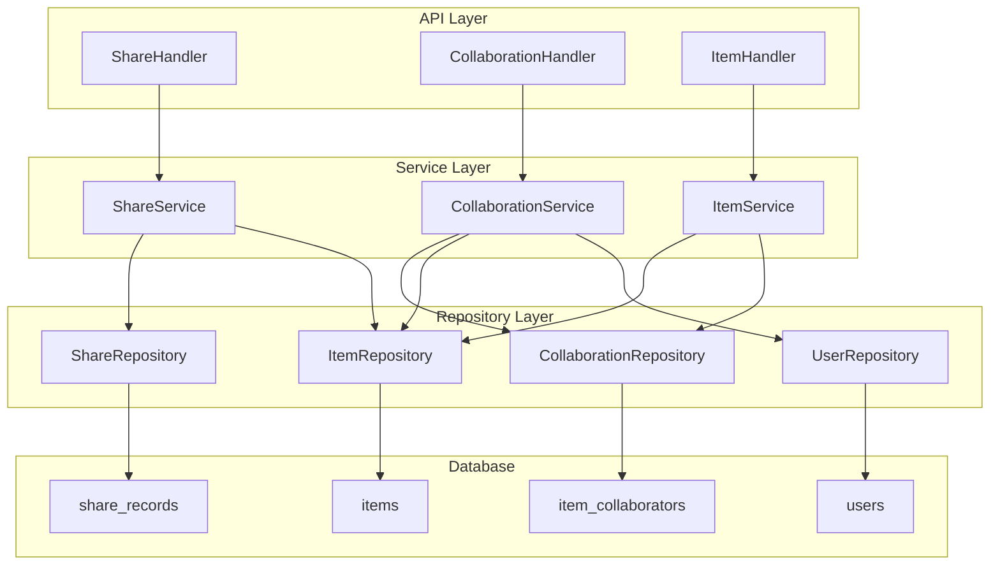
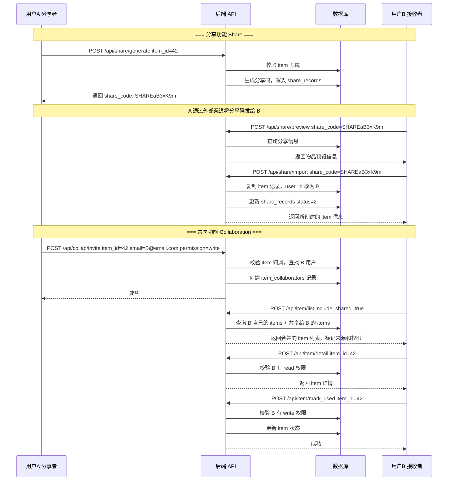

# 物品分享与共享功能设计文档

## 1. 概述

本文档为 ThingsExpired 项目设计 **分享（Share）** 与 **共享（Collaboration）** 两大功能。

### 1.1 核心概念区分

| 功能 | 说明 | 数据关系 |
|------|------|----------|
| **分享（Share）** | A 用户将已创建的 item **复制一份**给 B 用户，导入后两个 item **互相独立**运行 | 两份独立数据，仅在 `share_records` 表记录来源 |
| **共享（Collaboration）** | A 用户创建 item 后，邀请 B 用户 **直接访问同一份数据**，B 拥有读/写权限 | 同一份数据，通过 `item_collaborators` 表控制权限 |

### 1.2 技术约束

- 数据库：SQLite（Bun:sqlite + Drizzle ORM）
- 认证：JWT Token，`userId` 从 Token 中提取
- 项目分层：`Handler → Service → Repository`
- 使用 Zod 做参数校验
- 现有的 item 所有权检查逻辑：`item.userId !== userId → CodeForbidden`

---

## 2. 数据库表设计

### 2.1 表：`share_records`（分享记录）

记录每次分享操作的来源和目标，用于追溯和统计。

```typescript
// src/model/share.ts
import { sqliteTable, text, integer, index } from "drizzle-orm/sqlite-core";

export const shareRecords = sqliteTable(
  "share_records",
  {
    id: integer("id").primaryKey({ autoIncrement: true }),
    // 分享者
    sharerUserId: integer("sharer_user_id").notNull(),
    // 被分享者的分享码（由系统自动生成）
    shareCode: text("share_code", { length: 32 }).notNull().unique(),
    // 原始 item ID（分享时记录的来源）
    sourceItemId: integer("source_item_id").notNull(),
    // 目标 item ID（导入后生成的新 item ID），为 null 表示尚未导入
    targetItemId: integer("target_item_id"),
    // 导入者的用户 ID，为 null 表示尚未导入
    importerUserId: integer("importer_user_id"),
    // 分享码过期时间（7天有效）
    expiresAt: text("expires_at").notNull(),
    // 分享码状态: 1=有效, 2=已使用, 3=已过期, 4=已撤销
    status: integer("status").notNull().default(1),
    createdAt: text("created_at").notNull(),
    updatedAt: text("updated_at").notNull(),
  },
  (table) => ({
    sharerIdx: index("idx_share_records_sharer").on(table.sharerUserId),
    importerIdx: index("idx_share_records_importer").on(table.importerUserId),
    codeIdx: index("idx_share_records_code").on(table.shareCode),
    sourceItemIdx: index("idx_share_records_source_item").on(table.sourceItemId),
  }),
);

export type ShareRecord = typeof shareRecords.$inferSelect;
export type InsertShareRecord = typeof shareRecords.$inferInsert;
```

**字段说明：**

| 字段 | 类型 | 说明 |
|------|------|------|
| `id` | INTEGER PK | 自增主键 |
| `sharer_user_id` | INTEGER NOT NULL | 分享者用户 ID |
| `share_code` | TEXT UNIQUE | 8-32 位随机分享码 |
| `source_item_id` | INTEGER NOT NULL | 被分享的原始 item ID |
| `target_item_id` | INTEGER | 导入后生成的新 item ID（null 表示未导入） |
| `importer_user_id` | INTEGER | 导入者用户 ID（null 表示未导入） |
| `expires_at` | TEXT NOT NULL | 过期时间（生成后 7 天） |
| `status` | INTEGER DEFAULT 1 | 1=有效, 2=已使用, 3=已过期, 4=已撤销 |
| `created_at` | TEXT NOT NULL | 创建时间 |
| `updated_at` | TEXT NOT NULL | 更新时间 |

### 2.2 表：`item_collaborators`（物品协作者）

记录每个 item 被共享给哪些用户，及其权限级别。

```typescript
// src/model/collaboration.ts
import { sqliteTable, text, integer, uniqueIndex } from "drizzle-orm/sqlite-core";

export const itemCollaborators = sqliteTable(
  "item_collaborators",
  {
    id: integer("id").primaryKey({ autoIncrement: true }),
    // 被共享的 item ID
    itemId: integer("item_id").notNull(),
    // 协作者用户 ID
    collaboratorUserId: integer("collaborator_user_id").notNull(),
    // 权限级别: read = 只读, write = 读写
    permission: text("permission", { length: 10 }).notNull().default("read"),
    // 邀请者用户 ID（item 的拥有者）
    inviterUserId: integer("inviter_user_id").notNull(),
    // 状态: 1=有效, 0=已撤销
    status: integer("status").notNull().default(1),
    createdAt: text("created_at").notNull(),
    updatedAt: text("updated_at").notNull(),
  },
  (table) => ({
    // 一个 item 对同一个用户只能有一条协作记录
    itemUserUniqueIdx: uniqueIndex("idx_collab_item_user").on(
      table.itemId,
      table.collaboratorUserId,
    ),
    itemIdx: index("idx_collab_item").on(table.itemId),
    userIdx: index("idx_collab_user").on(table.collaboratorUserId),
  }),
);

export type ItemCollaborator = typeof itemCollaborators.$inferSelect;
export type InsertItemCollaborator = typeof itemCollaborators.$inferInsert;
```

**字段说明：**

| 字段 | 类型 | 说明 |
|------|------|------|
| `id` | INTEGER PK | 自增主键 |
| `item_id` | INTEGER NOT NULL | 被共享的 item ID |
| `collaborator_user_id` | INTEGER NOT NULL | 协作者用户 ID |
| `permission` | TEXT NOT NULL | `read`=只读, `write`=读写 |
| `inviter_user_id` | INTEGER NOT NULL | 邀请者（物品拥有者） |
| `status` | INTEGER DEFAULT 1 | 1=有效, 0=已撤销 |
| `created_at` | TEXT NOT NULL | 创建时间 |
| `updated_at` | TEXT NOT NULL | 更新时间 |

### 2.3 建表 SQL（补充到 `initDB` 中）

```sql
-- 分享记录表
CREATE TABLE IF NOT EXISTS share_records (
  id INTEGER PRIMARY KEY AUTOINCREMENT,
  sharer_user_id INTEGER NOT NULL,
  share_code TEXT NOT NULL UNIQUE,
  source_item_id INTEGER NOT NULL,
  target_item_id INTEGER,
  importer_user_id INTEGER,
  expires_at TEXT NOT NULL,
  status INTEGER NOT NULL DEFAULT 1,
  created_at TEXT NOT NULL,
  updated_at TEXT NOT NULL
);

-- 物品协作者表
CREATE TABLE IF NOT EXISTS item_collaborators (
  id INTEGER PRIMARY KEY AUTOINCREMENT,
  item_id INTEGER NOT NULL,
  collaborator_user_id INTEGER NOT NULL,
  permission TEXT NOT NULL DEFAULT 'read',
  inviter_user_id INTEGER NOT NULL,
  status INTEGER NOT NULL DEFAULT 1,
  created_at TEXT NOT NULL,
  updated_at TEXT NOT NULL
);

-- 索引
CREATE INDEX IF NOT EXISTS idx_share_records_sharer ON share_records(sharer_user_id);
CREATE INDEX IF NOT EXISTS idx_share_records_importer ON share_records(importer_user_id);
CREATE UNIQUE INDEX IF NOT EXISTS idx_share_records_code ON share_records(share_code);
CREATE INDEX IF NOT EXISTS idx_share_records_source_item ON share_records(source_item_id);
CREATE UNIQUE INDEX IF NOT EXISTS idx_collab_item_user ON item_collaborators(item_id, collaborator_user_id);
CREATE INDEX IF NOT EXISTS idx_collab_item ON item_collaborators(item_id);
CREATE INDEX IF NOT EXISTS idx_collab_user ON item_collaborators(collaborator_user_id);
```

### 2.4 Model 导出更新

在 [`src/model/index.ts`](src/model/index.ts) 中添加导出：

```typescript
export { shareRecords } from "@/model/share";
export { itemCollaborators } from "@/model/collaboration";
```

---

## 3. 错误码扩展

在 [`src/errors/code.ts`](src/errors/code.ts) 中添加：

```typescript
// 分享相关
export const CodeShareNotFound = 5001;     // 分享码不存在
export const CodeShareExpired = 5002;      // 分享码已过期
export const CodeShareUsed = 5003;         // 分享码已使用
export const CodeShareRevoked = 5004;      // 分享码已撤销
export const CodeShareOwn = 5005;          // 不能分享给自己的物品
export const CodeShareSelfImport = 5006;   // 不能导入自己的分享

// 协作相关
export const CodeCollabNotFound = 5101;    // 协作关系不存在
export const CodeCollabExists = 5102;      // 协作者已存在
export const CodeCollabUserNotFound = 5103; // 目标用户不存在
export const CodeCollabNotAllowed = 5104;  // 没有协作权限
export const CodeCollabSelfInvite = 5105;  // 不能邀请自己
```

> **注意**：现有 `CodeInternalError = 5001` 和 `CodeDatabaseError = 5002` 需要调整，建议将系统错误码改为 9001/9002，或将分享错误码改为 6001 系列。

**推荐方案（避免冲突）**：将分享错误码设为 6001-6006，协作错误码设为 6101-6105。

---

## 4. 分享（Share）功能设计

### 4.1 业务流程

```
用户A (分享者)                    用户B (接收者)
     |                                |
     |  1. POST /api/share/generate   |
     |  (选择自己的某个 item)         |
     |                                 |
     |  2. 返回 share_code            |
     |  (A 将 share_code 发给 B)      |
     |                                 |
     |                   3. POST /api/share/import
     |                   (输入 share_code)
     |                                 |
     |  4. 系统根据 source_item_id 复制 item
     |  并在 B 的账户下创建新 item
     |  同时更新 share_records 记录
     |                                 |
     |                   5. 返回导入后的新 item 信息
```

### 4.2 关键设计决策

1. **分享码生成规则**：使用 `nanoid` 或 `uuid` 生成 8 位短码（更易传播），如 `"SHARE" + 8位随机字符`
2. **分享码有效期**：7 天（由系统固定，可在 config 中配置）
3. **分享码状态机**：`1(有效) → 2(已使用)` 或 `1(有效) → 3(已过期)` 或 `1(有效) → 4(已撤销)`
4. **导入时的分类处理**：
   - 方式一：保留原始 `category_id`（如果 B 也有同名分类则自动映射）
   - 方式二：要求 B 导入时提供 `category_id`
   - **推荐方式一**：简单导入，B 后续可自行修改分类
5. **一个分享码只能使用一次**

### 4.3 API 接口

#### 4.3.1 生成分享码

```
POST /api/share/generate
认证：需要
```

**请求参数：**

| 参数 | 类型 | 必填 | 说明 |
|------|------|------|------|
| `item_id` | number | 是 | 要分享的物品 ID |

**响应数据：**

```json
{
  "code": 0,
  "message": "success",
  "data": {
    "share_id": 1,
    "share_code": "SHAREaB3xK9m",
    "source_item_id": 42,
    "expires_at": "2026-05-13T00:29:00.000Z",
    "status": 1,
    "created_at": "2026-05-06T00:29:00.000Z"
  }
}
```

**逻辑说明：**
1. 校验 `item_id` 是否存在且属于当前用户
2. 检查该 item 是否已有未过期的有效分享码（防止重复生成）
3. 生成随机分享码，创建 `share_records` 记录
4. 返回分享码

#### 4.3.2 通过分享码导入物品

```
POST /api/share/import
认证：需要
```

**请求参数：**

| 参数 | 类型 | 必填 | 说明 |
|------|------|------|------|
| `share_code` | string | 是 | 分享码 |
| `category_id` | number | 否 | 导入后归属的分类 ID（可选，默认为用户的首个分类） |

**响应数据：**

```json
{
  "code": 0,
  "message": "success",
  "data": {
    "new_item": {
      "item_id": 100,
      "user_id": 2,
      "category_id": 5,
      "name": "牛奶",
      "description": "鲜牛奶",
      "quantity": 2,
      "unit": "瓶",
      "expired_at": "2026-05-20T00:00:00.000Z",
      "remind_days": 3,
      "status": 1,
      "created_at": "2026-05-06T00:30:00.000Z"
    },
    "share_record": {
      "share_id": 1,
      "share_code": "SHAREaB3xK9m",
      "importer_user_id": 2,
      "status": 2
    }
  }
}
```

**逻辑说明：**
1. 根据 `share_code` 查找 `share_records`，验证：
   - 分享码存在且 `status = 1(有效)`
   - 当前时间 < `expires_at`（未过期）
   - 分享者不是当前用户（不能导入自己的分享）
2. 根据 `source_item_id` 查找原始 item
3. 在数据库中复制一条新的 item 记录：
   - `userId` = 当前用户
   - `categoryId` = 请求中的 `category_id` 或原始 `category_id`
   - 其余字段保持不变
4. 更新 `share_records` 记录：
   - `target_item_id` = 新 item 的 ID
   - `importer_user_id` = 当前用户 ID
   - `status` = 2(已使用)
5. 返回新 item 信息和更新后的分享记录

#### 4.3.3 撤销分享码

```
POST /api/share/revoke
认证：需要
```

**请求参数：**

| 参数 | 类型 | 必填 | 说明 |
|------|------|------|------|
| `share_code` | string | 是 | 要撤销的分享码 |

**逻辑说明：**
1. 校验分享码存在且属于当前用户
2. 仅允许撤销 `status = 1(有效)` 的记录
3. 将 status 更新为 4(已撤销)

#### 4.3.4 查看我的分享记录

```
POST /api/share/my_shares
认证：需要
```

**请求参数：**

| 参数 | 类型 | 必填 | 说明 |
|------|------|------|------|
| `page` | number | 否 | 页码，默认 1 |
| `page_size` | number | 否 | 每页数量，默认 10 |
| `status` | number | 否 | 筛选状态（1=有效, 2=已使用, 3=已过期, 4=已撤销） |

**响应数据：**

```json
{
  "code": 0,
  "message": "success",
  "data": {
    "list": [
      {
        "share_id": 1,
        "share_code": "SHAREaB3xK9m",
        "source_item": {
          "item_id": 42,
          "name": "牛奶"
        },
        "target_item": {
          "item_id": 100,
          "name": "牛奶"
        },
        "importer": {
          "user_id": 2,
          "username": "lisi"
        },
        "expires_at": "2026-05-13T00:29:00.000Z",
        "status": 2,
        "created_at": "2026-05-06T00:29:00.000Z"
      }
    ],
    "total": 1,
    "page": 1
  }
}
```

#### 4.3.5 查看我可导入的分享（通过分享码查询）

```
POST /api/share/preview
认证：需要
```

**请求参数：**

| 参数 | 类型 | 必填 | 说明 |
|------|------|------|------|
| `share_code` | string | 是 | 分享码 |

**响应数据：**

```json
{
  "code": 0,
  "message": "success",
  "data": {
    "share_code": "SHAREaB3xK9m",
    "item_name": "牛奶",
    "item_description": "鲜牛奶",
    "quantity": 2,
    "unit": "瓶",
    "expired_at": "2026-05-20T00:00:00.000Z",
    "sharer": {
      "user_id": 1,
      "username": "zhangsan"
    },
    "expires_at": "2026-05-13T00:29:00.000Z"
  }
}
```

**逻辑说明：** 预览分享信息，不实际导入。用于 B 用户查看分享详情后再决定是否导入。

---

## 5. 共享（Collaboration）功能设计

### 5.1 业务流程

```
用户A (物品拥有者)                用户B (协作者)
     |                                |
     |  1. POST /api/collab/invite    |
     |  (指定 item_id + B的邮箱)      |
     |                                |
     |  2. 系统查找 B 用户           |
     |  创建协作关系                  |
     |                                |
     |  3. B 登录后，调用             |
     |  POST /api/collab/collaborations|
     |  查看所有共享给我的 item        |
     |                                |
     |                         4. B 查看 item 详情
     |                         或对 item 进行操作
     |                                |
     |  5. A 也可撤销协作             |
     |  POST /api/collab/revoke       |
```

### 5.2 关键设计决策

1. **权限模型**：每个协作者有 `read`（只读）或 `write`（读写）权限
2. **权限检查**：在 `ItemService` 中，除了检查 `item.userId === userId`（拥有者），还需检查 `item_collaborators` 表
3. **写操作限制**：`read` 权限的协作者只能查看详情，不能 `update`/`delete`/`markUsed`
4. **列表查询**：共享给用户的 item 应和用户自己的 item 一起在列表中展示，并标记来源
5. **分类归属**：共享的 item 仍使用拥有者（A）的分类，协作者看到的分类与原始一致

#### 权限检查逻辑变更

现有的权限检查是直属的 `item.userId !== userId → Forbidden`，共享功能引入后需要改造为：

```
function checkItemAccess(userId, itemId, requiredPermission):
  item = itemRepo.findById(itemId)
  if (!item) throw ItemNotFound
  
  // Case 1: 用户是物品拥有者
  if (item.userId === userId):
    return item  // 完全访问权限
  
  // Case 2: 用户是协作者
  collab = collabRepo.findByItemIdAndUserId(itemId, userId)
  if (collab && collab.status === 1):
    if (requiredPermission === "read"):
      return item  // 只读权限可查看
    if (requiredPermission === "write" && collab.permission === "write"):
      return item  // 写权限可修改
    throw Forbidden  // 权限不足
  
  throw Forbidden  // 无任何权限
```

**影响的现有方法：**
- `detail()` → 需要 `read` 权限
- `update()` → 需要 `write` 权限（且必须是拥有者或拥有 write 权限的协作者）
- `delete()` → 仅限拥有者
- `markUsed()` → 需要 `write` 权限

### 5.3 API 接口

#### 5.3.1 邀请协作者

```
POST /api/collab/invite
认证：需要
```

**请求参数：**

| 参数 | 类型 | 必填 | 说明 |
|------|------|------|------|
| `item_id` | number | 是 | 要共享的物品 ID |
| `email` | string | 是 | 被邀请用户的邮箱 |
| `permission` | string | 否 | 权限：`read`(只读) 或 `write`(读写)，默认 `read` |

**逻辑说明：**
1. 校验 `item_id` 存在且属于当前用户（仅拥有者可邀请）
2. 通过 `email` 查找目标用户是否存在
3. 不能邀请自己
4. 不能重复邀请（检查是否已有协作记录）
5. 创建 `item_collaborators` 记录

#### 5.3.2 撤销协作者

```
POST /api/collab/revoke
认证：需要
```

**请求参数：**

| 参数 | 类型 | 必填 | 说明 |
|------|------|------|------|
| `item_id` | number | 是 | 物品 ID |
| `collaborator_user_id` | number | 是 | 协作者用户 ID |

**逻辑说明：**
1. 校验当前用户是 item 的拥有者
2. 将协作记录 `status` 设为 0(已撤销)

#### 5.3.3 查看物品的协作者列表

```
POST /api/collab/collaborators
认证：需要
```

**请求参数：**

| 参数 | 类型 | 必填 | 说明 |
|------|------|------|------|
| `item_id` | number | 是 | 物品 ID |

**响应数据：**

```json
{
  "code": 0,
  "message": "success",
  "data": {
    "owner": {
      "user_id": 1,
      "username": "zhangsan"
    },
    "collaborators": [
      {
        "id": 1,
        "user_id": 2,
        "username": "lisi",
        "email": "lisi@example.com",
        "permission": "write",
        "status": 1,
        "created_at": "2026-05-06T00:30:00.000Z"
      }
    ]
  }
}
```

#### 5.3.4 修改协作者权限

```
POST /api/collab/update_permission
认证：需要
```

**请求参数：**

| 参数 | 类型 | 必填 | 说明 |
|------|------|------|------|
| `item_id` | number | 是 | 物品 ID |
| `collaborator_user_id` | number | 是 | 协作者用户 ID |
| `permission` | string | 是 | 新权限：`read` 或 `write` |

#### 5.3.5 查看我参与的共享物品列表

```
POST /api/collab/my_collaborations
认证：需要
```

**请求参数：**

| 参数 | 类型 | 必填 | 说明 |
|------|------|------|------|
| `page` | number | 否 | 页码，默认 1 |
| `page_size` | number | 否 | 每页数量，默认 10 |

**响应数据：**

```json
{
  "code": 0,
  "message": "success",
  "data": {
    "list": [
      {
        "item_id": 42,
        "name": "牛奶",
        "description": "鲜牛奶",
        "expired_at": "2026-05-20T00:00:00.000Z",
        "status": 1,
        "permission": "write",
        "owner": {
          "user_id": 1,
          "username": "zhangsan"
        },
        "created_at": "2026-05-01T00:00:00.000Z"
      }
    ],
    "total": 1,
    "page": 1
  }
}
```

#### 5.3.6 修改 Item 列表接口（原有的 `/api/item/list`）

原有的 Item 列表接口需要改造，使其同时返回 **用户自己的 item** 和 **共享给用户的 item**，并在返回数据中标识来源。

在原有请求参数基础上新增可选参数：

| 参数 | 类型 | 必填 | 说明 |
|------|------|------|------|
| `include_shared` | boolean | 否 | 是否包含共享给我的 item，默认 false |
| `source` | string | 否 | 筛选来源：`own`(自己的), `shared`(共享的) |

**改造后的 ItemVO：**

```typescript
export interface ItemVO {
  item_id: number;
  user_id: number;
  category_id: number;
  name: string;
  description: string | null;
  quantity: number;
  unit: string | null;
  expired_at: string;
  remind_days: number;
  status: number;
  created_at: string;
  // 新增字段：标记物品来源
  source: "own" | "shared";
  // 如果是共享物品，返回拥有者信息
  owner?: {
    user_id: number;
    username: string;
  };
  // 当前用户的权限（仅共享物品有值）
  permission?: "read" | "write";
}
```

---

## 6. 后端架构改造方案

### 6.1 新增文件清单

| 文件路径 | 说明 |
|----------|------|
| [`src/model/share.ts`](src/model/share.ts) | 分享记录数据模型（Drizzle schema） |
| [`src/model/collaboration.ts`](src/model/collaboration.ts) | 协作关系数据模型（Drizzle schema） |
| [`src/model/dto/share.ts`](src/model/dto/share.ts) | 分享模块的请求参数 Zod 校验 |
| [`src/model/dto/collaboration.ts`](src/model/dto/collaboration.ts) | 协作模块的请求参数 Zod 校验 |
| [`src/model/vo/share.ts`](src/model/vo/share.ts) | 分享模块的 VO 定义 |
| [`src/model/vo/collaboration.ts`](src/model/vo/collaboration.ts) | 协作模块的 VO 定义 |
| [`src/repository/share.ts`](src/repository/share.ts) | 分享记录 Repository |
| [`src/repository/collaboration.ts`](src/repository/collaboration.ts) | 协作关系 Repository |
| [`src/service/share.ts`](src/service/share.ts) | 分享 Service |
| [`src/service/collaboration.ts`](src/service/collaboration.ts) | 协作 Service |
| [`src/handler/share.ts`](src/handler/share.ts) | 分享 Handler |
| [`src/handler/collaboration.ts`](src/handler/collaboration.ts) | 协作 Handler |

### 6.2 需修改的文件

| 文件路径 | 修改内容 |
|----------|----------|
| [`src/model/index.ts`](src/model/index.ts) | 导出新增的 `shareRecords` 和 `itemCollaborators` |
| [`src/errors/code.ts`](src/errors/code.ts) | 新增分享和协作相关错误码 |
| [`src/repository/db.ts`](src/repository/db.ts) | `initDB` 中新增建表 SQL |
| [`src/repository/interfaces.ts`](src/repository/interfaces.ts) | 新增 `IShareRepository` 和 `ICollaborationRepository` 接口 |
| [`src/service/interfaces.ts`](src/service/interfaces.ts) | 新增 `IShareService` 和 `ICollaborationService` 接口，修改 `IItemService` |
| [`src/service/item.ts`](src/service/item.ts) | 修改权限检查逻辑，支持协作者访问 |
| [`src/handler/item.ts`](src/handler/item.ts) | 如果 ItemVO 字段变更，相应调整 |
| [`src/router/index.ts`](src/router/index.ts) | 新增分享和协作路由注册 |
| [`src/index.ts`](src/index.ts) | 新增 Repository/Service/Handler 实例化及注入 |

### 6.3 依赖注入关系变化

```
// 新增依赖
const shareRepo = new ShareRepository(db);
const collabRepo = new CollaborationRepository(db);

const shareService = new ShareService(shareRepo, itemRepo);
const collabService = new CollaborationService(collabRepo, itemRepo, userRepo);

const shareHandler = new ShareHandler(shareService);
const collabHandler = new CollaborationHandler(collabService);

// 修改：ItemService 需要注入 collabRepo 以支持协作权限检查
const itemService = new ItemService(itemRepo, collabRepo);

// 新增路由注册
createRouter(
  userHandler,
  categoryHandler,
  itemHandler,
  shareHandler,       // 新增
  collabHandler,      // 新增
  authMiddleware,
  loggerMiddleware,
  config,
);
```

### 6.4 路由结构

```
/api/share/generate          POST  生成分享码
/api/share/preview           POST  预览分享信息
/api/share/import            POST  导入分享物品
/api/share/revoke            POST  撤销分享码
/api/share/my_shares         POST  查看我的分享记录

/api/collab/invite           POST  邀请协作者
/api/collab/revoke           POST  撤销协作者
/api/collab/collaborators    POST  查看物品协作者列表
/api/collab/update_permission POST  修改协作者权限
/api/collab/my_collaborations POST  查看我参与的共享物品
```

---

## 7. 实现建议与注意事项

### 7.1 分享功能实现要点

1. **分享码生成**：使用 `crypto.randomBytes(6).toString("hex")` 生成 12 位十六进制码，或使用 `nanoid(8)` 自定义字母表生成更短更容易传播的码
2. **分享码查重**：生成时需要检查是否已存在，如果冲突则重新生成
3. **导入时的分类映射**：
   - 如果 B 未提供 `category_id`，使用原始分类 ID
   - 如果原始分类 ID 在 B 的分类中不存在，则使用 B 的第一个分类作为兜底
   - 可选：如果 B 有同名分类，自动映射
4. **过期清理**：可以通过现有的定时任务 `ItemExpirationService` 框架扩展，定期将过期分享码标记为 `status=3`

### 7.2 共享功能实现要点

1. **权限检查重构**：需要将 `ItemService` 中的 `item.userId !== userId` 检查替换为统一的权限检查方法
2. **Item 列表合并**：`item/list` 接口需要 UNION 查询或两次查询合并，返回用户自己的 item + 共享的 item
3. **共享物品的过期提醒**：共享的物品同样会过期，协作者应能看到过期提醒
4. **写权限的限制**：
   - 协作者可调用 `item/update`（部分字段可能受限，如 `category_id`）
   - 协作者可调用 `item/mark_used`
   - 协作者 **不能** 调用 `item/delete`
5. **并发安全**：SQLite WAL 模式已启用，写入操作不会有锁表问题

### 7.3 扩展性考虑

1. **分享码批量生成**：当前设计一次生成一个分享码，未来可以支持一次分享多个 item 生成一个分享码（暂不需要）
2. **共享群组**：当前设计是单个邀请，未来可以引入群组概念（暂不需要）
3. **通知系统**：目前无通知机制，用户需要手动刷新查看。未来可考虑为邀请添加通知提示

### 7.4 安全注意事项

1. 分享码应足够随机，防止被暴力枚举
2. 分享码不包含可识别的用户信息
3. 导入操作必须是原子性的（失败时保证数据一致性）
4. 权限检查必须每个接口都执行，不能遗漏
5. 协作者列表接口只有 item 拥有者才能查看
6. 防止协作者将自己的权限提升（只能由拥有者修改权限）

---

## 8. 实施步骤

建议按以下顺序实施：

| 步骤 | 内容 | 涉及文件 |
|------|------|----------|
| 1 | 新增 Drizzle Model：`share` 和 `collaboration` | `src/model/share.ts`, `src/model/collaboration.ts`, `src/model/index.ts` |
| 2 | 新增错误码 | `src/errors/code.ts` |
| 3 | 更新 `initDB` 建表 SQL | `src/repository/db.ts` |
| 4 | 新增 Repository 接口和实现 | `src/repository/interfaces.ts`, `src/repository/share.ts`, `src/repository/collaboration.ts` |
| 5 | 新增 DTO 和 VO 定义 | `src/model/dto/share.ts`, `src/model/dto/collaboration.ts`, `src/model/vo/share.ts`, `src/model/vo/collaboration.ts` |
| 6 | 新增 Service 接口和实现 | `src/service/interfaces.ts`, `src/service/share.ts`, `src/service/collaboration.ts` |
| 7 | 修改 ItemService 支持协作权限 | `src/service/item.ts` |
| 8 | 新增 Handler | `src/handler/share.ts`, `src/handler/collaboration.ts` |
| 9 | 注册路由和依赖注入 | `src/router/index.ts`, `src/index.ts` |
| 10 | 编写单元测试 | `test/service/share_service.test.ts`, `test/service/collaboration_service.test.ts` |

---

## 9. 架构关系图



---

## 10. 分享与共享流程对比图


