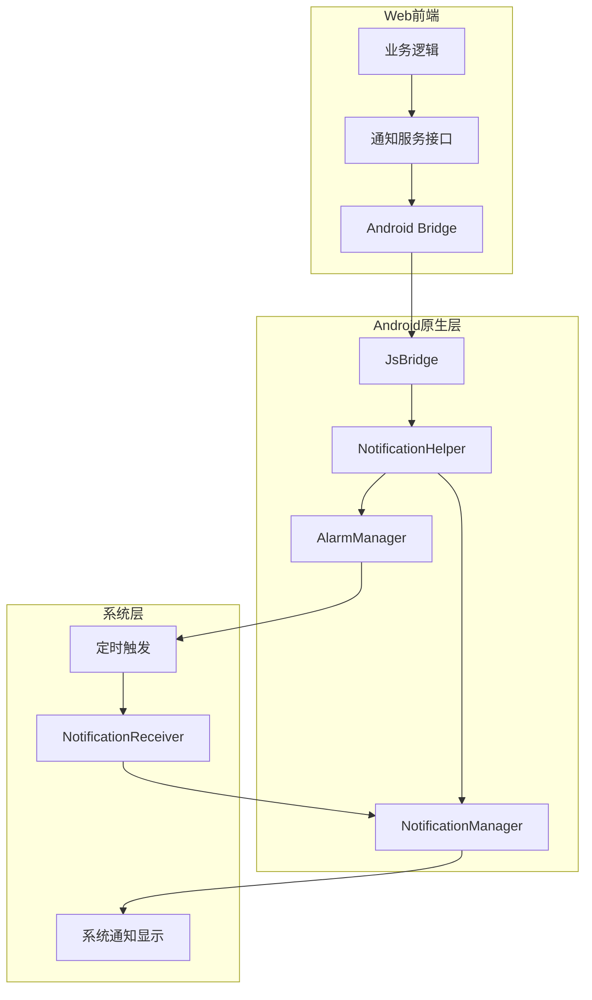
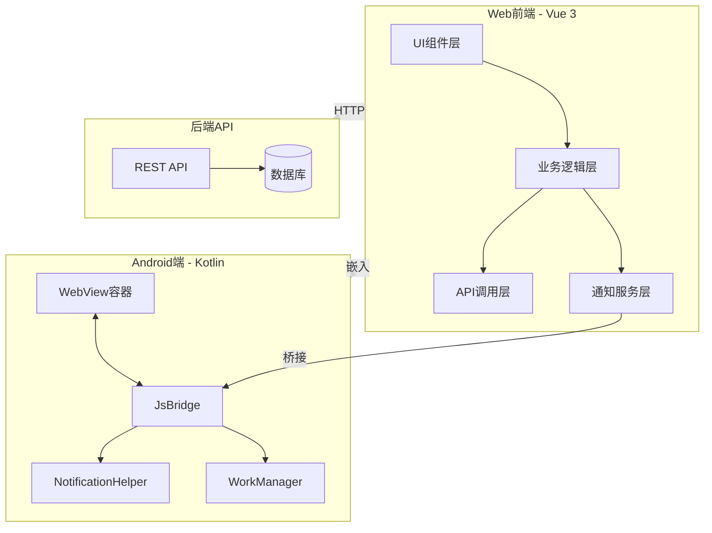

# ThingsExpired 安卓端技术方案

## 目录

1. [项目概述](#1-项目概述)
2. [技术选型](#2-技术选型)
3. [项目架构](#3-项目架构)
4. [WebView集成方案](#4-webview集成方案)
5. [原生通知实现](#5-原生通知实现)
6. [后台任务调度](#6-后台任务调度)
7. [Web端适配](#7-web端适配)
8. [权限管理](#8-权限管理)
9. [架构总览](#9-架构总览)
10. [实施路线图](#10-实施路线图)

---

## 1. 项目概述

### 1.1 项目背景

ThingsExpired是一个物品过期管理应用，现有Web端基于Vue 3构建。为了提供更好的移动端用户体验和原生通知能力，需要开发Android原生应用。

### 1.2 技术栈概览

| 类别 | 技术 | 版本 |
|------|------|------|
| 框架 | Vue | 3.5.32 |
| 构建工具 | Vite | 7.3.2 |
| 状态管理 | Pinia | 3.0.4 |
| 路由 | Vue Router | 5.0.4 |
| UI组件库 | PrimeVue | 4.5.5 |
| CSS框架 | Tailwind CSS | 4.2.4 |
| 国际化 | vue-i18n | 11.3.2 |
| HTTP客户端 | Axios | 1.15.2 |
| 工具库 | @vueuse/core | 14.2.1 |
| 日期处理 | dayjs | 1.11.20 |

### 1.3 核心功能模块

#### 1.3.1 用户认证模块
- 登录/登出功能
- Token管理(存储于localStorage)
- 路由守卫保护
- 权限验证

#### 1.3.2 物品管理模块
- 物品CRUD操作
- 过期状态追踪(正常/已过期/已消耗)
- 分类管理
- 搜索过滤功能
- 分页展示

#### 1.3.3 通知提示模块
- 基于PrimeVue Toast的应用内通知
- 成功/错误/警告/信息四种类型

#### 1.3.4 主题与国际化
- 明/暗/自动三种主题模式
- 中/英文双语支持
- 响应式布局(桌面端/移动端)

### 1.4 安卓端开发目标

- 复用Web端全部UI和业务逻辑
- 实现原生系统通知
- 支持后台定时检查过期物品
- 支持精确的定时提醒
- 最小化应用体积

---

## 2. 技术选型

### 2.1 框架选择：原生Kotlin + WebView

| 方案 | 优点 | 缺点 | 推荐度 |
|------|------|------|--------|
| **原生Kotlin + WebView** | 性能最优、原生通知支持、完全控制 | 需要Android开发经验 | ⭐⭐⭐⭐⭐ |
| Jetpack Compose + WebView | 现代化UI、声明式开发 | 学习曲线较陡 | ⭐⭐⭐⭐ |
| React Native WebView | 跨平台、JavaScript生态 | 性能略逊、包体积大 | ⭐⭐⭐ |
| Flutter WebView | 跨平台、UI一致性好 | 需要Dart语言、包体积大 | ⭐⭐⭐ |
| Capacitor | 前端友好、插件丰富 | 性能一般、定制性差 | ⭐⭐⭐ |

**推荐方案：原生Kotlin + WebView**

理由：
1. 完全控制原生通知系统
2. 可实现后台服务和定时任务
3. 最小的应用体积
4. 最佳的性能表现

### 2.2 核心依赖

```kotlin
// build.gradle.kts (Module: app)
dependencies {
    // AndroidX核心库
    implementation("androidx.core:core-ktx:1.12.0")
    implementation("androidx.appcompat:appcompat:1.6.1")
    implementation("androidx.webkit:webkit:1.9.0")
    
    // 协程
    implementation("org.jetbrains.kotlinx:kotlinx-coroutines-android:1.7.3")
    
    // WorkManager (后台任务)
    implementation("androidx.work:work-runtime-ktx:2.9.0")
    
    // DataStore (本地存储)
    implementation("androidx.datastore:datastore-preferences:1.0.0")
    
    // 网络请求
    implementation("com.squareup.okhttp3:okhttp:4.12.0")
    implementation("com.squareup.okhttp3:logging-interceptor:4.12.0")
    
    // JSON解析
    implementation("com.google.code.gson:gson:2.10.1")
}
```

---

## 3. 项目架构

### 3.1 项目结构

```
ThingsExpired.Android/
├── app/
│   ├── src/
│   │   ├── main/
│   │   │   ├── java/com/thingsexpired/app/
│   │   │   │   ├── MainActivity.kt           # 主Activity
│   │   │   │   ├── App.kt                    # Application类
│   │   │   │   │
│   │   │   │   ├── webview/
│   │   │   │   │   ├── WebViewFragment.kt   # WebView容器
│   │   │   │   │   ├── JsBridge.kt          # JS桥接
│   │   │   │   │   └── WebViewClient.kt     # WebView客户端
│   │   │   │   │
│   │   │   │   ├── notification/
│   │   │   │   │   ├── NotificationHelper.kt # 通知工具类
│   │   │   │   │   └── NotificationChannel.kt # 通知渠道
│   │   │   │   │
│   │   │   │   ├── service/
│   │   │   │   │   ├── ExpiryCheckWorker.kt # 后台检查Worker
│   │   │   │   │   └── ApiService.kt        # API服务
│   │   │   │   │
│   │   │   │   ├── bridge/
│   │   │   │   │   ├── NativeBridge.kt      # 原生桥接接口
│   │   │   │   │   └── BridgeCommand.kt      # 桥接命令
│   │   │   │   │
│   │   │   │   └── util/
│   │   │   │       ├── AssetLoader.kt       # 资源加载器
│   │   │   │       └── PreferenceManager.kt # 偏好设置
│   │   │   │
│   │   │   ├── assets/
│   │   │   │   └── webapp/                  # Web应用资源
│   │   │   │       ├── index.html
│   │   │   │       ├── assets/
│   │   │   │       └── ...
│   │   │   │
│   │   │   ├── res/
│   │   │   │   ├── layout/
│   │   │   │   │   └── activity_main.xml
│   │   │   │   ├── values/
│   │   │   │   │   └── strings.xml
│   │   │   │   └── drawable/
│   │   │   │       └── ic_notification.xml
│   │   │   │
│   │   │   └── AndroidManifest.xml
│   │   │
│   │   └── test/                            # 单元测试
│   │
│   └── build.gradle.kts
│
└── build.gradle.kts                         # 项目级配置
```

### 3.2 模块职责说明

| 模块 | 职责 |
|------|------|
| `MainActivity.kt` | 应用入口，初始化WebView和通知 |
| `webview/` | WebView配置和生命周期管理 |
| `notification/` | 原生通知创建、调度和管理 |
| `service/` | 后台任务和API调用 |
| `bridge/` | JS与原生代码通信桥接 |
| `util/` | 工具类和辅助函数 |

---

## 4. WebView集成方案

### 4.1 主Activity实现

```kotlin
// MainActivity.kt
class MainActivity : AppCompatActivity() {
    
    private lateinit var webView: WebView
    private lateinit var jsBridge: JsBridge
    
    override fun onCreate(savedInstanceState: Bundle?) {
        super.onCreate(savedInstanceState)
        setContentView(R.layout.activity_main)
        
        setupWebView()
        setupNotificationChannel()
        scheduleBackgroundCheck()
    }
    
    private fun setupWebView() {
        webView = findViewById(R.id.webView)
        jsBridge = JsBridge(this)
        
        webView.settings.apply {
            javaScriptEnabled = true
            domStorageEnabled = true
            databaseEnabled = true
            allowFileAccess = true
            mixedContentMode = WebSettings.MIXED_CONTENT_ALWAYS_ALLOW
        }
        
        // 添加JS接口
        webView.addJavascriptInterface(jsBridge, "AndroidBridge")
        
        // 设置WebViewClient
        webView.webViewClient = object : WebViewClient() {
            override fun shouldOverrideUrlLoading(view: WebView?, url: String?): Boolean {
                // 处理外部链接
                return false
            }
            
            override fun onPageFinished(view: WebView?, url: String?) {
                super.onPageFinished(view, url)
                // 注入平台标识
                webView.evaluateJavascript("window.__PLATFORM__ = 'android';", null)
            }
        }
        
        // 加载Web应用
        loadWebApp()
    }
    
    private fun loadWebApp() {
        // 优先加载本地资源
        if (hasLocalAssets()) {
            webView.loadUrl("file:///android_asset/webapp/index.html")
        } else {
            webView.loadUrl("https://your-domain.com")
        }
    }
    
    private fun hasLocalAssets(): Boolean {
        return try {
            assets.list("webapp")?.isNotEmpty() == true
        } catch (e: Exception) {
            false
        }
    }
    
    override fun onBackPressed() {
        if (webView.canGoBack()) {
            webView.goBack()
        } else {
            super.onBackPressed()
        }
    }
}
```

### 4.2 JS桥接实现

```kotlin
// JsBridge.kt
class JsBridge(private val context: Context) {
    
    private val notificationHelper = NotificationHelper(context)
    private val gson = Gson()
    
    @JavascriptInterface
    fun getPlatform(): String {
        return "android"
    }
    
    @JavascriptInterface
    fun showNotification(title: String, message: String) {
        notificationHelper.showNotification(title, message)
    }
    
    @JavascriptInterface
    fun scheduleReminder(itemId: Int, itemName: String, expiredAt: String, remindDays: Int) {
        val expiredDate = LocalDateTime.parse(expiredAt, DateTimeFormatter.ISO_DATE_TIME)
        val remindTime = expiredDate.minusDays(remindDays.toLong())
        
        // 使用AlarmManager或WorkManager调度通知
        notificationHelper.scheduleNotification(
            notificationId = itemId,
            title = "物品过期提醒",
            message = "$itemName 即将过期",
            triggerTime = remindTime
        )
    }
    
    @JavascriptInterface
    fun cancelReminder(itemId: Int) {
        notificationHelper.cancelNotification(itemId)
    }
    
    @JavascriptInterface
    fun getAppVersion(): String {
        return try {
            val pInfo = context.packageManager.getPackageInfo(context.packageName, 0)
            pInfo.versionName ?: "1.0.0"
        } catch (e: Exception) {
            "1.0.0"
        }
    }
    
    @JavascriptInterface
    fun getDeviceId(): String {
        // 获取设备唯一标识
        return Settings.Secure.getString(
            context.contentResolver,
            Settings.Secure.ANDROID_ID
        )
    }
}
```

### 4.3 Web资源打包策略

Web资源打包流程：
1. 执行 `pnpm build` 生成 `dist` 目录
2. 将 `dist` 目录内容复制到Android项目的 `app/src/main/assets/webapp/` 目录
3. 编译Android应用时自动包含Web资源

```groovy
// build.gradle.kts
android {
    // ...
    
    // 自动复制Web资源任务
    tasks.register("copyWebAssets") {
        doLast {
            val webDistDir = file("../../ThingsExpired_web-dev/dist")
            val assetsDir = file("src/main/assets/webapp")
            
            if (webDistDir.exists()) {
                copy {
                    from(webDistDir)
                    into(assetsDir)
                }
            }
        }
    }
    
    // 在打包前执行复制
    tasks.named("preBuild") {
        dependsOn("copyWebAssets")
    }
}
```

---

## 5. 原生通知实现

### 5.1 通知渠道配置

```kotlin
// notification/NotificationChannel.kt
object NotificationChannels {
    const val CHANNEL_ID_EXPIRY = "expiry_reminder"
    const val CHANNEL_ID_GENERAL = "general"
    
    fun createChannels(context: Context) {
        if (Build.VERSION.SDK_INT >= Build.VERSION_CODES.O) {
            val notificationManager = context.getSystemService(NotificationManager::class.java)
            
            // 过期提醒渠道
            val expiryChannel = NotificationChannel(
                CHANNEL_ID_EXPIRY,
                "过期提醒",
                NotificationManager.IMPORTANCE_HIGH
            ).apply {
                description = "物品过期提醒通知"
                enableLights(true)
                lightColor = Color.RED
                enableVibration(true)
                vibrationPattern = longArrayOf(0, 500, 200, 500)
            }
            
            // 通用通知渠道
            val generalChannel = NotificationChannel(
                CHANNEL_ID_GENERAL,
                "通用通知",
                NotificationManager.IMPORTANCE_DEFAULT
            ).apply {
                description = "应用通用通知"
            }
            
            notificationManager.createNotificationChannels(listOf(expiryChannel, generalChannel))
        }
    }
}
```

### 5.2 通知工具类

```kotlin
// notification/NotificationHelper.kt
class NotificationHelper(private val context: Context) {
    
    private val notificationManager = context.getSystemService(Context.NOTIFICATION_SERVICE) as NotificationManager
    private val alarmManager = context.getSystemService(Context.ALARM_SERVICE) as AlarmManager
    
    fun showNotification(title: String, message: String, notificationId: Int = System.currentTimeMillis().toInt()) {
        val intent = Intent(context, MainActivity::class.java).apply {
            flags = Intent.FLAG_ACTIVITY_NEW_TASK or Intent.FLAG_ACTIVITY_CLEAR_TASK
        }
        
        val pendingIntent = PendingIntent.getActivity(
            context, 0, intent,
            PendingIntent.FLAG_IMMUTABLE or PendingIntent.FLAG_UPDATE_CURRENT
        )
        
        val notification = NotificationCompat.Builder(context, NotificationChannels.CHANNEL_ID_GENERAL)
            .setSmallIcon(R.drawable.ic_notification)
            .setContentTitle(title)
            .setContentText(message)
            .setPriority(NotificationCompat.PRIORITY_HIGH)
            .setAutoCancel(true)
            .setContentIntent(pendingIntent)
            .build()
        
        notificationManager.notify(notificationId, notification)
    }
    
    fun scheduleNotification(
        notificationId: Int,
        title: String,
        message: String,
        triggerTime: LocalDateTime
    ) {
        val intent = Intent(context, NotificationReceiver::class.java).apply {
            putExtra("notificationId", notificationId)
            putExtra("title", title)
            putExtra("message", message)
        }
        
        val pendingIntent = PendingIntent.getBroadcast(
            context, notificationId, intent,
            PendingIntent.FLAG_IMMUTABLE or PendingIntent.FLAG_UPDATE_CURRENT
        )
        
        val triggerAtMillis = triggerTime.atZone(ZoneId.systemDefault()).toInstant().toEpochMilli()
        
        if (Build.VERSION.SDK_INT >= Build.VERSION_CODES.S) {
            if (alarmManager.canScheduleExactAlarms()) {
                alarmManager.setExactAndAllowWhileIdle(
                    AlarmManager.RTC_WAKEUP,
                    triggerAtMillis,
                    pendingIntent
                )
            } else {
                // 使用非精确闹钟
                alarmManager.set(
                    AlarmManager.RTC_WAKEUP,
                    triggerAtMillis,
                    pendingIntent
                )
            }
        } else {
            alarmManager.setExactAndAllowWhileIdle(
                AlarmManager.RTC_WAKEUP,
                triggerAtMillis,
                pendingIntent
            )
        }
    }
    
    fun cancelNotification(notificationId: Int) {
        val intent = Intent(context, NotificationReceiver::class.java)
        val pendingIntent = PendingIntent.getBroadcast(
            context, notificationId, intent,
            PendingIntent.FLAG_IMMUTABLE
        )
        alarmManager.cancel(pendingIntent)
        notificationManager.cancel(notificationId)
    }
}

// NotificationReceiver.kt
class NotificationReceiver : BroadcastReceiver() {
    override fun onReceive(context: Context, intent: Intent) {
        val notificationId = intent.getIntExtra("notificationId", 0)
        val title = intent.getStringExtra("title") ?: "提醒"
        val message = intent.getStringExtra("message") ?: ""
        
        NotificationHelper(context).showNotification(title, message, notificationId)
    }
}
```

### 5.3 通知流程图



---

## 6. 后台任务调度

### 6.1 WorkManager后台检查

```kotlin
// service/ExpiryCheckWorker.kt
class ExpiryCheckWorker(
    context: Context,
    params: WorkerParameters
) : CoroutineWorker(context, params) {
    
    private val apiService = ApiService()
    private val notificationHelper = NotificationHelper(context)
    private val preferenceManager = PreferenceManager(context)
    
    override suspend fun doWork(): Result {
        return try {
            // 检查用户是否已登录
            val token = preferenceManager.getToken()
            if (token.isNullOrEmpty()) {
                return Result.success()
            }
            
            // 获取即将过期的物品
            val expiringItems = apiService.getExpiringItems(token)
            
            // 发送通知
            expiringItems.forEach { item ->
                notificationHelper.showNotification(
                    notificationId = item.id,
                    title = "物品即将过期",
                    message = "${item.name} 将在 ${item.remainingDays} 天后过期"
                )
            }
            
            Result.success()
        } catch (e: Exception) {
            Log.e("ExpiryCheckWorker", "检查过期物品失败", e)
            Result.retry()
        }
    }
    
    companion object {
        const val WORK_NAME = "expiry_check_work"
        
        fun schedule(context: Context) {
            val periodicWorkRequest = PeriodicWorkRequestBuilder<ExpiryCheckWorker>(
                24, TimeUnit.HOURS,  // 每24小时执行一次
                1, TimeUnit.HOURS   // 弹性时间1小时
            )
                .setConstraints(
                    Constraints.Builder()
                        .setRequiredNetworkType(NetworkType.CONNECTED)
                        .setRequiresBatteryNotLow(true)
                        .build()
                )
                .build()
            
            WorkManager.getInstance(context).enqueueUniquePeriodicWork(
                WORK_NAME,
                ExistingPeriodicWorkPolicy.KEEP,
                periodicWorkRequest
            )
        }
    }
}
```

### 6.2 API服务实现

```kotlin
// service/ApiService.kt
class ApiService {
    private val client = OkHttpClient.Builder()
        .addInterceptor(HttpLoggingInterceptor().apply {
            level = HttpLoggingInterceptor.Level.BODY
        })
        .build()
    
    private val gson = Gson()
    
    suspend fun getExpiringItems(token: String): List<ExpiringItem> {
        val request = Request.Builder()
            .url("https://your-api.com/api/items/expiring")
            .header("Authorization", "Bearer $token")
            .build()
        
        return withContext(Dispatchers.IO) {
            val response = client.newCall(request).execute()
            if (response.isSuccessful) {
                val body = response.body?.string() ?: return@withContext emptyList()
                val result = gson.fromJson<ApiResponse<List<ExpiringItem>>>(body, object : TypeToken<ApiResponse<List<ExpiringItem>>>() {}.type)
                result.data ?: emptyList()
            } else {
                emptyList()
            }
        }
    }
}

data class ExpiringItem(
    val id: Int,
    val name: String,
    val remainingDays: Int
)

data class ApiResponse<T>(
    val code: Int,
    val data: T?,
    val message: String?
)
```

### 6.3 偏好设置管理

```kotlin
// util/PreferenceManager.kt
class PreferenceManager(context: Context) {
    private val dataStore = context.createDataStore("app_settings")
    
    companion object {
        private val TOKEN_KEY = stringPreferencesKey("auth_token")
        private val USER_ID_KEY = intPreferencesKey("user_id")
    }
    
    suspend fun saveToken(token: String) {
        dataStore.edit { preferences ->
            preferences[TOKEN_KEY] = token
        }
    }
    
    fun getToken(): Flow<String?> = dataStore.data.map { preferences ->
        preferences[TOKEN_KEY]
    }
    
    suspend fun clearToken() {
        dataStore.edit { preferences ->
            preferences.remove(TOKEN_KEY)
        }
    }
}
```

---

## 7. Web端适配

### 7.1 平台检测工具

```typescript
// src/utils/platform.ts

/**
 * 运行平台类型
 */
export type Platform = 'web' | 'windows' | 'android'

/**
 * 平台检测器
 */
export class PlatformDetector {
    private static _platform: Platform | null = null
    
    /**
     * 获取当前平台
     */
    static getPlatform(): Platform {
        if (this._platform) {
            return this._platform
        }
        
        // 检测Android端
        if (this.isAndroidApp()) {
            this._platform = 'android'
            return 'android'
        }
        
        this._platform = 'web'
        return 'web'
    }
    
    /**
     * 检测是否为Android应用
     */
    static isAndroidApp(): boolean {
        return !!(window as any).AndroidBridge
    }
    
    /**
     * 检测是否为移动端
     */
    static isMobile(): boolean {
        return /Android|webOS|iPhone|iPad|iPod|BlackBerry|IEMobile|Opera Mini/i.test(
            navigator.userAgent
        )
    }
    
    /**
     * 检测是否支持原生通知
     */
    static supportsNativeNotification(): boolean {
        return this.getPlatform() === 'android'
    }
}

/**
 * 获取平台桥接对象
 */
export function getNativeBridge(): any {
    const platform = PlatformDetector.getPlatform()
    
    if (platform === 'android') {
        return (window as any).AndroidBridge
    }
    
    return null
}
```

### 7.2 Android通知服务实现

```typescript
// src/services/notification/androidNotification.ts

import type { INotificationService, NotificationOptions, ReminderOptions } from './types'
import { PlatformDetector, getNativeBridge } from '@/utils/platform'

/**
 * Android通知服务
 * 通过WebView桥接调用原生通知
 */
export class AndroidNotificationService implements INotificationService {
    readonly platform = 'android' as const
    readonly isSupported: boolean
    private bridge: any
    
    constructor() {
        this.isSupported = PlatformDetector.isAndroidApp()
        this.bridge = getNativeBridge()
    }
    
    async show(options: NotificationOptions): Promise<void> {
        if (!this.isSupported || !this.bridge) {
            console.warn('Android原生通知不可用')
            return
        }
        
        try {
            this.bridge.showNotification(options.title, options.body)
        } catch (error) {
            console.error('显示Android通知失败:', error)
        }
    }
    
    async scheduleReminder(options: ReminderOptions): Promise<void> {
        if (!this.isSupported || !this.bridge) {
            console.warn('Android原生通知不可用')
            return
        }
        
        try {
            this.bridge.scheduleReminder(
                options.itemId,
                options.itemName,
                options.expiredAt.toISOString(),
                options.remindDays
            )
        } catch (error) {
            console.error('调度Android提醒失败:', error)
        }
    }
    
    async cancelReminder(itemId: number): Promise<void> {
        if (!this.isSupported || !this.bridge) {
            return
        }
        
        try {
            this.bridge.cancelReminder(itemId)
        } catch (error) {
            console.error('取消Android提醒失败:', error)
        }
    }
    
    async requestPermission(): Promise<boolean> {
        // Android应用在安装时已请求权限
        return true
    }
    
    async hasPermission(): Promise<boolean> {
        return true
    }
}
```

### 7.3 通知服务接口定义

```typescript
// src/services/notification/types.ts

/**
 * 通知选项
 */
export interface NotificationOptions {
    /** 通知标题 */
    title: string
    /** 通知内容 */
    body: string
    /** 通知图标 */
    icon?: string
    /** 通知标签(用于替换相同标签的通知) */
    tag?: string
    /** 点击通知后的跳转路径 */
    clickUrl?: string
}

/**
 * 定时提醒选项
 */
export interface ReminderOptions {
    /** 物品ID */
    itemId: number
    /** 物品名称 */
    itemName: string
    /** 过期时间 */
    expiredAt: Date
    /** 提前提醒天数 */
    remindDays: number
}

/**
 * 通知服务接口
 */
export interface INotificationService {
    /** 当前平台 */
    readonly platform: Platform
    
    /** 是否支持原生通知 */
    readonly isSupported: boolean
    
    /**
     * 显示即时通知
     */
    show(options: NotificationOptions): Promise<void>
    
    /**
     * 调度定时提醒
     */
    scheduleReminder(options: ReminderOptions): Promise<void>
    
    /**
     * 取消提醒
     */
    cancelReminder(itemId: number): Promise<void>
    
    /**
     * 请求通知权限
     */
    requestPermission(): Promise<boolean>
    
    /**
     * 检查是否有通知权限
     */
    hasPermission(): Promise<boolean>
}
```

### 7.4 通知服务工厂

```typescript
// src/services/notification/index.ts

import type { INotificationService } from './types'
import { PlatformDetector } from '@/utils/platform'
import { WebNotificationService } from './webNotification'
import { AndroidNotificationService } from './androidNotification'

/**
 * 通知服务实例(单例)
 */
let notificationService: INotificationService | null = null

/**
 * 获取通知服务实例
 */
export function getNotificationService(): INotificationService {
    if (notificationService) {
        return notificationService
    }
    
    const platform = PlatformDetector.getPlatform()
    
    switch (platform) {
        case 'android':
            notificationService = new AndroidNotificationService()
            break
        default:
            notificationService = new WebNotificationService()
    }
    
    return notificationService
}

/**
 * 组合式函数：使用通知服务
 */
export function useNotification() {
    const service = getNotificationService()
    
    return {
        platform: service.platform,
        isSupported: service.isSupported,
        show: service.show.bind(service),
        scheduleReminder: service.scheduleReminder.bind(service),
        cancelReminder: service.cancelReminder.bind(service),
        requestPermission: service.requestPermission.bind(service),
        hasPermission: service.hasPermission.bind(service),
    }
}

// 导出类型
export * from './types'
```

### 7.5 提醒服务集成

```typescript
// src/services/reminderService.ts

import { getNotificationService, type ReminderOptions } from './notification'
import { getItemList, type Item } from '@/api'

/**
 * 提醒服务
 * 管理物品过期提醒
 */
export class ReminderService {
    private notificationService = getNotificationService()
    private scheduledItems: Set<number> = new Set()
    
    /**
     * 同步物品提醒
     * 根据物品列表调度或取消提醒
     */
    async syncReminders(items: Item[]): Promise<void> {
        const now = new Date()
        
        for (const item of items) {
            // 跳过已过期或已消耗的物品
            if (item.status !== 1) {
                this.cancelReminder(item.item_id)
                continue
            }
            
            const expiredAt = new Date(item.expired_at)
            const remindAt = new Date(expiredAt)
            remindAt.setDate(remindAt.getDate() - item.remind_days)
            
            // 如果提醒时间已过，跳过
            if (remindAt <= now) {
                continue
            }
            
            // 调度提醒
            await this.scheduleReminder({
                itemId: item.item_id,
                itemName: item.name,
                expiredAt,
                remindDays: item.remind_days,
            })
        }
    }
    
    /**
     * 调度单个物品提醒
     */
    async scheduleReminder(options: ReminderOptions): Promise<void> {
        if (this.scheduledItems.has(options.itemId)) {
            return
        }
        
        await this.notificationService.scheduleReminder(options)
        this.scheduledItems.add(options.itemId)
    }
    
    /**
     * 取消单个物品提醒
     */
    async cancelReminder(itemId: number): Promise<void> {
        if (!this.scheduledItems.has(itemId)) {
            return
        }
        
        await this.notificationService.cancelReminder(itemId)
        this.scheduledItems.delete(itemId)
    }
    
    /**
     * 取消所有提醒
     */
    async cancelAllReminders(): Promise<void> {
        for (const itemId of this.scheduledItems) {
            await this.notificationService.cancelReminder(itemId)
        }
        this.scheduledItems.clear()
    }
}

// 单例实例
let reminderService: ReminderService | null = null

export function getReminderService(): ReminderService {
    if (!reminderService) {
        reminderService = new ReminderService()
    }
    return reminderService
}
```

---

## 8. 权限管理

### 8.1 AndroidManifest权限配置

```xml
<!-- AndroidManifest.xml -->
<manifest>
    <!-- 通知权限 (Android 13+) -->
    <uses-permission android:name="android.permission.POST_NOTIFICATIONS" />
    
    <!-- 后台服务权限 -->
    <uses-permission android:name="android.permission.RECEIVE_BOOT_COMPLETED" />
    <uses-permission android:name="android.permission.SCHEDULE_EXACT_ALARM" />
    <uses-permission android:name="android.permission.INTERNET" />
    <uses-permission android:name="android.permission.ACCESS_NETWORK_STATE" />
    
    <application>
        <!-- 后台检查Worker -->
        <service
            android:name=".service.ExpiryCheckService"
            android:exported="false" />
        
        <!-- 通知接收器 -->
        <receiver
            android:name=".notification.NotificationReceiver"
            android:exported="false" />
        
        <!-- 开机启动 -->
        <receiver
            android:name=".receiver.BootReceiver"
            android:exported="false">
            <intent-filter>
                <action android:name="android.intent.action.BOOT_COMPLETED" />
            </intent-filter>
        </receiver>
    </application>
</manifest>
```

### 8.2 运行时权限请求

```kotlin
// MainActivity.kt
class MainActivity : AppCompatActivity() {
    
    private val notificationPermissionLauncher = registerForActivityResult(
        ActivityResultContracts.RequestPermission()
    ) { isGranted ->
        if (!isGranted) {
            Toast.makeText(
                this,
                "通知权限被拒绝，您将无法收到过期提醒",
                Toast.LENGTH_LONG
            ).show()
        }
    }
    
    override fun onCreate(savedInstanceState: Bundle?) {
        super.onCreate(savedInstanceState)
        
        // Android 13+ 需要请求通知权限
        if (Build.VERSION.SDK_INT >= Build.VERSION_CODES.TIRAMISU) {
            if (checkSelfPermission(Manifest.permission.POST_NOTIFICATIONS) != PackageManager.PERMISSION_GRANTED) {
                notificationPermissionLauncher.launch(Manifest.permission.POST_NOTIFICATIONS)
            }
        }
    }
}
```

### 8.3 开机启动接收器

```kotlin
// receiver/BootReceiver.kt
class BootReceiver : BroadcastReceiver() {
    override fun onReceive(context: Context, intent: Intent) {
        if (intent.action == Intent.ACTION_BOOT_COMPLETED) {
            // 重新调度后台检查任务
            ExpiryCheckWorker.schedule(context)
        }
    }
}
```

---

## 9. 架构总览

### 9.1 整体架构图



### 9.2 代码复用策略

| 层级 | Web端 | 安卓端 | 复用率 |
|------|-------|--------|--------|
| UI组件 | ✅ | ✅ 嵌入 | 100% |
| 业务逻辑 | ✅ | ✅ 嵌入 | 100% |
| API调用 | ✅ | ✅ 嵌入 | 100% |
| 状态管理 | ✅ | ✅ 嵌入 | 100% |
| 路由 | ✅ | ✅ 嵌入 | 100% |
| 通知服务 | Web API | 原生桥接 | 接口统一 |
| 后台任务 | ❌ | 原生实现 | 0% |

### 9.3 文件结构总览

```
ThingsExpired/
├── ThingsExpired_web-dev/           # Web前端项目
│   ├── src/
│   │   ├── services/
│   │   │   └── notification/         # 通知服务
│   │   │       ├── index.ts
│   │   │       ├── types.ts
│   │   │       ├── webNotification.ts
│   │   │       └── androidNotification.ts
│   │   ├── utils/
│   │   │   └── platform.ts          # 平台检测
│   │   └── ...
│   └── dist/                         # 构建输出
│
└── ThingsExpired.Android/            # Android项目
    ├── app/
    │   └── src/main/
    │       ├── java/.../
    │       │   ├── MainActivity.kt
    │       │   ├── JsBridge.kt
    │       │   ├── notification/
    │       │   └── service/
    │       └── assets/
    │           └── webapp/           # Web资源(从dist复制)
    │               └── ...
    └── ...
```

---

## 10. 实施路线图

### 10.1 阶段一：Web端适配

**目标**：为Web端添加Android平台通知支持

**任务清单**：
- [ ] 创建平台检测工具 `src/utils/platform.ts`
- [ ] 创建通知服务接口 `src/services/notification/types.ts`
- [ ] 实现Web通知服务 `src/services/notification/webNotification.ts`
- [ ] 实现Android通知服务 `src/services/notification/androidNotification.ts`
- [ ] 创建通知服务工厂 `src/services/notification/index.ts`
- [ ] 创建提醒服务 `src/services/reminderService.ts`
- [ ] 更新Toast服务支持原生通知
- [ ] 在物品管理中集成提醒功能
- [ ] 更新Vite构建配置

### 10.2 阶段二：Android端开发

**目标**：开发Android原生应用

**任务清单**：
- [ ] 创建Android项目结构
- [ ] 集成WebView控件
- [ ] 实现Kotlin桥接服务
- [ ] 实现Android通知服务
- [ ] 实现WorkManager后台任务
- [ ] 配置通知渠道
- [ ] 实现运行时权限请求
- [ ] 配置应用签名和发布

### 10.3 阶段三：集成测试与优化

**目标**：确保功能完整性和稳定性

**任务清单**：
- [ ] 编写Android端测试用例
- [ ] 测试WebView加载和交互
- [ ] 测试通知功能
- [ ] 测试后台任务调度
- [ ] 测试权限请求流程
- [ ] 性能优化
- [ ] 文档完善

---

## 附录

### A. 技术栈版本要求

| 平台 | 技术 | 最低版本 | 推荐版本 |
|------|------|---------|---------|
| Web | Vue | 3.5+ | 3.5.32 |
| Web | Vite | 7.0+ | 7.3.2 |
| Android | Kotlin | 1.9+ | 2.0 |
| Android | minSdk | 24 | 26 |
| Android | targetSdk | 33 | 34 |

### B. 参考资源

- [Android WebView 指南](https://developer.android.com/guide/webapps/webview)
- [Android Notifications](https://developer.android.com/develop/ui/views/notifications)
- [WorkManager 指南](https://developer.android.com/topic/libraries/architecture/workmanager)
- [Android权限最佳实践](https://developer.android.com/training/permissions/requesting)

### C. 常见问题

**Q1: 如何处理WebView中的路由？**

A: 在Android端，需要拦截WebView的URL加载，对于外部链接使用系统浏览器打开，内部路由则由Vue Router处理。

**Q2: 如何处理Token过期？**

A: Token存储在WebView的localStorage中，Android端可以通过桥接接口获取Token用于后台API调用。Token过期时，前端会自动跳转到登录页。

**Q3: 如何调试WebView内容？**

A: 使用Chrome DevTools的远程调试功能 (chrome://inspect)

**Q4: 后台任务不执行怎么办？**

A: 检查WorkManager的约束条件，确保设备满足网络和电池要求。部分厂商ROM可能需要手动开启后台运行权限。

**Q5: 通知不显示怎么办？**

A: 检查通知渠道是否正确创建，Android 13+需要运行时请求通知权限，部分厂商ROM需要手动开启应用通知权限。