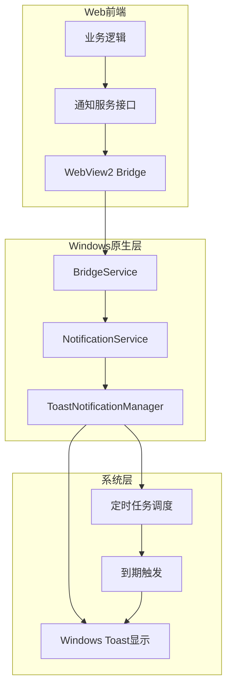
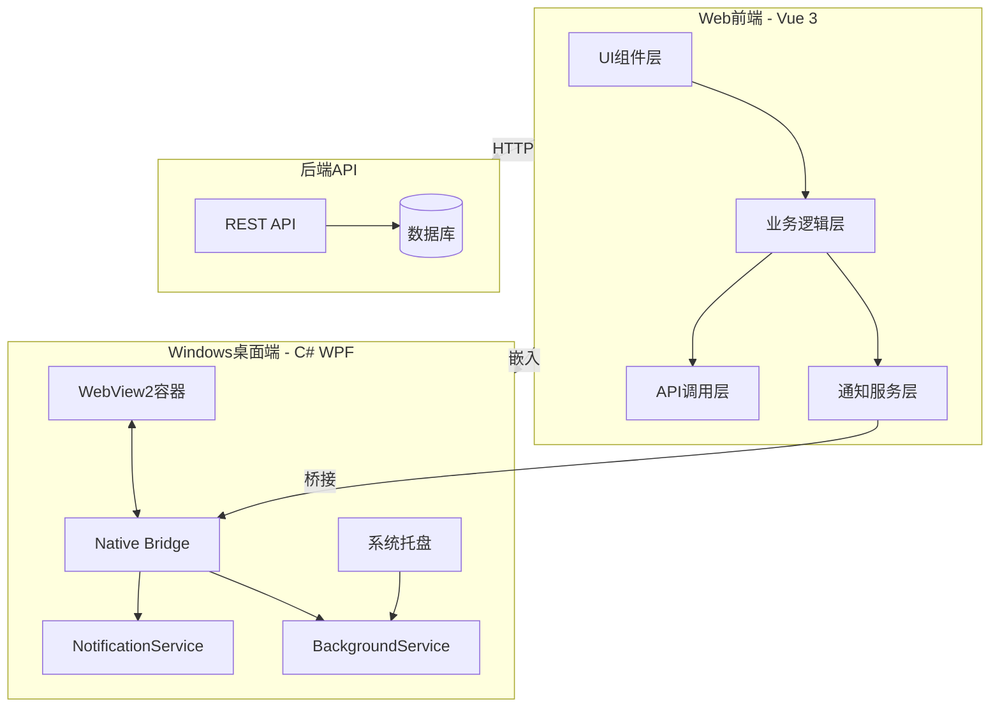

# ThingsExpired 桌面端技术方案

## 目录

1. [项目概述](#1-项目概述)
2. [技术选型](#2-技术选型)
3. [项目架构](#3-项目架构)
4. [WebView2集成方案](#4-webview2集成方案)
5. [原生通知实现](#5-原生通知实现)
6. [后台任务调度](#6-后台任务调度)
7. [JS桥接通信](#7-js桥接通信)
8. [Web端适配](#8-web端适配)
9. [系统托盘功能](#9-系统托盘功能)
10. [架构总览](#10-架构总览)
11. [实施路线图](#11-实施路线图)

---

## 1. 项目概述

### 1.1 项目背景

ThingsExpired是一个物品过期管理应用，现有Web端基于Vue 3构建。为了提供更好的桌面端用户体验和原生通知能力，需要开发Windows桌面原生应用。

### 1.2 技术栈概览

| 类别 | 技术 | 版本 |
|------|------|------|
| 框架 | Vue | 3.5.32 |
| 构建工具 | Vite | 7.3.2 |
| 状态管理 | Pinia | 3.0.4 |
| 路由 | Vue Router | 5.0.4 |
| UI组件库 | PrimeVue | 4.5.5 |
| CSS框架 | Tailwind CSS | 4.2.4 |
| 国际化 | vue-i18n | 11.3.2 |
| HTTP客户端 | Axios | 1.15.2 |
| 工具库 | @vueuse/core | 14.2.1 |
| 日期处理 | dayjs | 1.11.20 |

### 1.3 核心功能模块

#### 1.3.1 用户认证模块
- 登录/登出功能
- Token管理(存储于localStorage)
- 路由守卫保护
- 权限验证

#### 1.3.2 物品管理模块
- 物品CRUD操作
- 过期状态追踪(正常/已过期/已消耗)
- 分类管理
- 搜索过滤功能
- 分页展示

#### 1.3.3 通知提示模块
- 基于PrimeVue Toast的应用内通知
- 成功/错误/警告/信息四种类型

#### 1.3.4 主题与国际化
- 明/暗/自动三种主题模式
- 中/英文双语支持
- 响应式布局(桌面端/移动端)

### 1.4 桌面端开发目标

- 复用Web端全部UI和业务逻辑
- 实现Windows原生系统通知
- 支持后台定时检查过期物品
- 支持精确的定时提醒
- 支持系统托盘运行
- 最小化应用体积

---

## 2. 技术选型

### 2.1 框架选择：WPF + WebView2

| 方案 | 优点 | 缺点 | 推荐度 |
|------|------|------|--------|
| **WPF + WebView2** | 成熟稳定、性能好、原生通知支持、.NET生态丰富 | 仅支持Windows | ⭐⭐⭐⭐⭐ |
| WinUI 3 + WebView2 | 现代化UI、支持Windows 11 | 生态较新、兼容性有限 | ⭐⭐⭐⭐ |
| Electron | 跨平台 | 资源占用大、需要Node.js | ⭐⭐⭐ |
| Avalonia + WebView | 跨平台 | WebView支持不完善 | ⭐⭐⭐ |

**推荐方案：WPF + WebView2**

理由：
1. WebView2基于Chromium，与Web端渲染一致
2. 原生支持Windows通知系统
3. 可直接调用.NET API实现后台任务
4. 与现有C#技术栈契合

### 2.2 核心依赖

```xml
<!-- NuGet包 -->
<PackageReference Include="Microsoft.Web.WebView2" Version="1.0.2210.55" />
<PackageReference Include="Microsoft.Toolkit.Uwp.Notifications" Version="7.1.3" />
<PackageReference Include="Hardcodet.NotifyIcon.Wpf" Version="1.1.0" />
```

---

## 3. 项目架构

### 3.1 项目结构

```
ThingsExpired.Desktop/
├── ThingsExpired.Desktop.sln
├── src/
│   ├── ThingsExpired.App/              # 主应用项目
│   │   ├── App.xaml                    # 应用入口
│   │   ├── App.xaml.cs
│   │   ├── MainWindow.xaml             # 主窗口(包含WebView2)
│   │   ├── MainWindow.xaml.cs
│   │   ├── Views/
│   │   │   └── TrayIcon.xaml          # 系统托盘
│   │   ├── Services/
│   │   │   ├── NotificationService.cs  # 原生通知服务
│   │   │   ├── BridgeService.cs        # JS桥接服务
│   │   │   └── BackgroundService.cs    # 后台任务服务
│   │   ├── Models/
│   │   │   └── NotificationPayload.cs  # 通知数据模型
│   │   └── Helpers/
│   │       └── WebAssetLoader.cs       # Web资源加载器
│   │
│   └── ThingsExpired.Core/             # 核心库(可选)
│       ├── Interfaces/
│       │   └── INotification.cs
│       └── Models/
│           └── Item.cs
│
└── assets/
    └── icon.ico                        # 应用图标
```

### 3.2 模块职责说明

| 模块 | 职责 |
|------|------|
| `MainWindow.xaml` | 主窗口，包含WebView2控件 |
| `Views/TrayIcon.xaml` | 系统托盘图标和菜单 |
| `Services/NotificationService.cs` | Windows原生通知创建和管理 |
| `Services/BridgeService.cs` | JS与原生代码通信桥接 |
| `Services/BackgroundService.cs` | 后台定时任务执行 |
| `Helpers/WebAssetLoader.cs` | Web资源加载和缓存 |

---

## 4. WebView2集成方案

### 4.1 主窗口实现

```xml
<!-- MainWindow.xaml -->
<Window x:Class="ThingsExpired.App.MainWindow"
        xmlns="http://schemas.microsoft.com/winfx/2006/xaml/presentation"
        xmlns:x="http://schemas.microsoft.com/winfx/2006/xaml"
        xmlns:wv2="clr-namespace:Microsoft.Web.WebView2.Wpf;assembly=Microsoft.Web.WebView2.Wpf"
        Title="ThingsExpired" Height="800" Width="1200"
        Icon="/assets/icon.ico">
    
    <Grid>
        <wv2:WebView2 Name="webView" 
                      Source="about:blank"
                      DefaultBackgroundColor="Transparent"/>
    </Grid>
</Window>
```

```csharp
// MainWindow.xaml.cs
public partial class MainWindow : Window
{
    public MainWindow()
    {
        InitializeComponent();
        InitializeWebView();
    }

    private async void InitializeWebView()
    {
        await webView.EnsureCoreWebView2Async();
        
        // 加载Web应用
        var htmlPath = GetWebAppPath();
        webView.Source = new Uri(htmlPath);
        
        // 注册桥接对象
        webView.CoreWebView2.AddHostObjectToScript("nativeBridge", new BridgeService());
        
        // 配置开发者工具(调试模式)
        #if DEBUG
        webView.CoreWebView2.OpenDevToolsWindow();
        #endif
    }

    private string GetWebAppPath()
    {
        // 优先使用本地打包资源
        var localPath = Path.Combine(AppDomain.CurrentDomain.BaseDirectory, "webapp", "index.html");
        if (File.Exists(localPath))
        {
            return localPath;
        }
        
        // 回退到远程服务器
        return "https://your-domain.com";
    }
}
```

### 4.2 Web资源打包策略

```xml
<!-- 项目文件配置 -->
<ItemGroup>
  <Content Include="webapp\**\*.*">
    <CopyToOutputDirectory>PreserveNewest</CopyToOutputDirectory>
  </Content>
</ItemGroup>
```

打包流程：
1. 执行 `pnpm build` 生成 `dist` 目录
2. 将 `dist` 目录内容复制到桌面端项目的 `webapp` 目录
3. 编译桌面端应用时自动包含Web资源

### 4.3 Web资源加载器

```csharp
// Helpers/WebAssetLoader.cs
public class WebAssetLoader
{
    private readonly string _basePath;
    
    public WebAssetLoader()
    {
        _basePath = Path.Combine(AppDomain.CurrentDomain.BaseDirectory, "webapp");
    }
    
    public bool HasLocalAssets()
    {
        return File.Exists(Path.Combine(_basePath, "index.html"));
    }
    
    public string GetIndexPath()
    {
        return Path.Combine(_basePath, "index.html");
    }
    
    public string GetAssetPath(string relativePath)
    {
        return Path.Combine(_basePath, relativePath);
    }
}
```

---

## 5. 原生通知实现

### 5.1 Windows通知服务

```csharp
// Services/NotificationService.cs
using Microsoft.Toolkit.Uwp.Notifications;
using Windows.Data.Xml.Dom;
using Windows.UI.Notifications;

public class NotificationService
{
    public void ShowNotification(string title, string message, string iconPath = null)
    {
        var toastContent = new ToastContentBuilder()
            .AddText(title)
            .AddText(message)
            .AddAppLogoOverride(new Uri(iconPath ?? GetDefaultIcon()))
            .AddButton(new ToastButton()
                .SetContent("查看详情")
                .AddArgument("action", "viewItem"))
            .GetToastContent();

        var toast = new ToastNotification(toastContent.GetXml());
        ToastNotificationManager.CreateToastNotifier().Show(toast);
    }

    public void ScheduleNotification(string title, string message, DateTime scheduledTime)
    {
        var toastContent = new ToastContentBuilder()
            .AddText(title)
            .AddText(message)
            .GetToastContent();

        var scheduledToast = new ScheduledToastNotification(
            toastContent.GetXml(),
            scheduledTime
        );
        
        ToastNotificationManager.CreateToastNotifier().AddToSchedule(scheduledToast);
    }
    
    public void CancelScheduledNotification(int notificationId)
    {
        var notifier = ToastNotificationManager.CreateToastNotifier();
        var scheduledNotifications = notifier.GetScheduledToastNotifications();
        
        var target = scheduledNotifications.FirstOrDefault(n => 
            n.Id == notificationId.ToString());
        
        if (target != null)
        {
            notifier.RemoveFromSchedule(target);
        }
    }
    
    private string GetDefaultIcon()
    {
        return Path.Combine(AppDomain.CurrentDomain.BaseDirectory, "assets", "icon.ico");
    }
}
```

### 5.2 通知数据模型

```csharp
// Models/NotificationPayload.cs
public class NotificationPayload
{
    public string Title { get; set; }
    public string Message { get; set; }
    public int ItemId { get; set; }
    public DateTime? ScheduledTime { get; set; }
    public string IconPath { get; set; }
}

public class ExpiringItem
{
    public int Id { get; set; }
    public string Name { get; set; }
    public int RemainingDays { get; set; }
    public DateTime ExpiredAt { get; set; }
}
```

### 5.3 通知流程图



---

## 6. 后台任务调度

### 6.1 后台服务实现

```csharp
// Services/BackgroundService.cs
public class BackgroundService : IDisposable
{
    private Timer _checkTimer;
    private readonly NotificationService _notificationService;
    private readonly HttpClient _httpClient;

    public BackgroundService()
    {
        _notificationService = new NotificationService();
        _httpClient = new HttpClient();
    }

    public void Start()
    {
        // 每小时检查一次过期物品
        _checkTimer = new Timer(CheckExpiringItems, null, TimeSpan.Zero, TimeSpan.FromHours(1));
    }

    private async void CheckExpiringItems(object state)
    {
        try
        {
            // 获取存储的Token
            var token = GetStoredToken();
            if (string.IsNullOrEmpty(token))
            {
                return;
            }
            
            // 调用API获取即将过期的物品
            var items = await FetchExpiringItems(token);
            
            foreach (var item in items)
            {
                _notificationService.ShowNotification(
                    "物品即将过期",
                    $"{item.Name} 将在 {item.RemainingDays} 天后过期"
                );
            }
        }
        catch (Exception ex)
        {
            // 错误处理
            Log.Error(ex, "检查过期物品失败");
        }
    }
    
    private async Task<List<ExpiringItem>> FetchExpiringItems(string token)
    {
        var request = new HttpRequestMessage(HttpMethod.Get, 
            "https://your-api.com/api/items/expiring");
        request.Headers.Authorization = new AuthenticationHeaderValue("Bearer", token);
        
        var response = await _httpClient.SendAsync(request);
        if (response.IsSuccessStatusCode)
        {
            var content = await response.Content.ReadAsStringAsync();
            return JsonSerializer.Deserialize<List<ExpiringItem>>(content) 
                ?? new List<ExpiringItem>();
        }
        
        return new List<ExpiringItem>();
    }
    
    private string GetStoredToken()
    {
        // 从WebView的localStorage获取Token
        // 或从本地配置文件读取
        return ConfigurationManager.AppSettings["AuthToken"];
    }

    public void Dispose()
    {
        _checkTimer?.Dispose();
        _httpClient?.Dispose();
    }
}
```

### 6.2 后台服务注册

```csharp
// App.xaml.cs
public partial class App : Application
{
    private BackgroundService _backgroundService;
    
    protected override void OnStartup(StartupEventArgs e)
    {
        base.OnStartup(e);
        
        // 启动后台服务
        _backgroundService = new BackgroundService();
        _backgroundService.Start();
    }
    
    protected override void OnExit(ExitEventArgs e)
    {
        _backgroundService?.Dispose();
        base.OnExit(e);
    }
}
```

---

## 7. JS桥接通信

### 7.1 桥接服务实现

```csharp
// Services/BridgeService.cs
[ClassInterface(ClassInterfaceType.AutoDual)]
[ComVisible(true)]
public class BridgeService
{
    private readonly NotificationService _notificationService = new();

    public string GetPlatform()
    {
        return "windows-desktop";
    }

    public void ShowNotification(string title, string message)
    {
        _notificationService.ShowNotification(title, message);
    }

    public void ScheduleReminder(int itemId, string itemName, DateTime expiredAt, int remindDays)
    {
        var remindTime = expiredAt.AddDays(-remindDays);
        _notificationService.ScheduleNotification(
            "物品过期提醒",
            $"{itemName} 即将过期",
            remindTime
        );
    }
    
    public void CancelReminder(int itemId)
    {
        _notificationService.CancelScheduledNotification(itemId);
    }

    public string GetAppVersion()
    {
        return Assembly.GetExecutingAssembly().GetName().Version?.ToString() ?? "1.0.0";
    }
    
    public string GetDeviceId()
    {
        // 获取设备唯一标识
        return Environment.MachineName;
    }
}
```

### 7.2 前端调用示例

```typescript
// 前端检测平台并调用原生能力
declare global {
    interface Window {
        chrome: {
            webview: {
                hostObjects: {
                    nativeBridge: {
                        GetPlatform: () => string
                        ShowNotification: (title: string, message: string) => void
                        ScheduleReminder: (itemId: number, itemName: string, expiredAt: string, remindDays: number) => void
                        CancelReminder: (itemId: number) => void
                    }
                }
            }
        }
    }
}

export function isDesktopApp(): boolean {
    return !!window.chrome?.webview?.hostObjects?.nativeBridge
}

export async function showNativeNotification(title: string, message: string) {
    if (isDesktopApp()) {
        await window.chrome.webview.hostObjects.nativeBridge.ShowNotification(title, message)
    } else {
        // 回退到Web Notification API
        new Notification(title, { body: message })
    }
}
```

---

## 8. Web端适配

### 8.1 平台检测工具

```typescript
// src/utils/platform.ts

/**
 * 运行平台类型
 */
export type Platform = 'web' | 'windows' | 'android'

/**
 * 平台检测器
 */
export class PlatformDetector {
    private static _platform: Platform | null = null
    
    /**
     * 获取当前平台
     */
    static getPlatform(): Platform {
        if (this._platform) {
            return this._platform
        }
        
        // 检测Windows桌面端
        if (this.isWindowsDesktop()) {
            this._platform = 'windows'
            return 'windows'
        }
        
        this._platform = 'web'
        return 'web'
    }
    
    /**
     * 检测是否为Windows桌面应用
     */
    static isWindowsDesktop(): boolean {
        return !!(window as any).chrome?.webview?.hostObjects?.nativeBridge
    }
    
    /**
     * 检测是否为移动端
     */
    static isMobile(): boolean {
        return /Android|webOS|iPhone|iPad|iPod|BlackBerry|IEMobile|Opera Mini/i.test(
            navigator.userAgent
        )
    }
    
    /**
     * 检测是否支持原生通知
     */
    static supportsNativeNotification(): boolean {
        return this.getPlatform() === 'windows'
    }
}

/**
 * 获取平台桥接对象
 */
export function getNativeBridge(): any {
    const platform = PlatformDetector.getPlatform()
    
    if (platform === 'windows') {
        return (window as any).chrome?.webview?.hostObjects?.nativeBridge
    }
    
    return null
}
```

### 8.2 Windows桌面通知实现

```typescript
// src/services/notification/windowsNotification.ts

import type { INotificationService, NotificationOptions, ReminderOptions } from './types'
import { PlatformDetector, getNativeBridge } from '@/utils/platform'

/**
 * Windows桌面通知服务
 * 通过WebView2桥接调用原生通知
 */
export class WindowsNotificationService implements INotificationService {
    readonly platform = 'windows' as const
    readonly isSupported: boolean
    private bridge: any
    
    constructor() {
        this.isSupported = PlatformDetector.isWindowsDesktop()
        this.bridge = getNativeBridge()
    }
    
    async show(options: NotificationOptions): Promise<void> {
        if (!this.isSupported || !this.bridge) {
            console.warn('Windows原生通知不可用')
            return
        }
        
        try {
            await this.bridge.ShowNotification(options.title, options.body)
        } catch (error) {
            console.error('显示Windows通知失败:', error)
        }
    }
    
    async scheduleReminder(options: ReminderOptions): Promise<void> {
        if (!this.isSupported || !this.bridge) {
            console.warn('Windows原生通知不可用')
            return
        }
        
        try {
            await this.bridge.ScheduleReminder(
                options.itemId,
                options.itemName,
                options.expiredAt.toISOString(),
                options.remindDays
            )
        } catch (error) {
            console.error('调度Windows提醒失败:', error)
        }
    }
    
    async cancelReminder(itemId: number): Promise<void> {
        if (!this.isSupported || !this.bridge) {
            return
        }
        
        try {
            await this.bridge.CancelReminder(itemId)
        } catch (error) {
            console.error('取消Windows提醒失败:', error)
        }
    }
    
    async requestPermission(): Promise<boolean> {
        // Windows桌面应用默认有通知权限
        return true
    }
    
    async hasPermission(): Promise<boolean> {
        return true
    }
}
```

### 8.3 通知服务接口定义

```typescript
// src/services/notification/types.ts

/**
 * 通知选项
 */
export interface NotificationOptions {
    /** 通知标题 */
    title: string
    /** 通知内容 */
    body: string
    /** 通知图标 */
    icon?: string
    /** 通知标签(用于替换相同标签的通知) */
    tag?: string
    /** 点击通知后的跳转路径 */
    clickUrl?: string
}

/**
 * 定时提醒选项
 */
export interface ReminderOptions {
    /** 物品ID */
    itemId: number
    /** 物品名称 */
    itemName: string
    /** 过期时间 */
    expiredAt: Date
    /** 提前提醒天数 */
    remindDays: number
}

/**
 * 通知服务接口
 */
export interface INotificationService {
    /** 当前平台 */
    readonly platform: Platform
    
    /** 是否支持原生通知 */
    readonly isSupported: boolean
    
    /**
     * 显示即时通知
     */
    show(options: NotificationOptions): Promise<void>
    
    /**
     * 调度定时提醒
     */
    scheduleReminder(options: ReminderOptions): Promise<void>
    
    /**
     * 取消提醒
     */
    cancelReminder(itemId: number): Promise<void>
    
    /**
     * 请求通知权限
     */
    requestPermission(): Promise<boolean>
    
    /**
     * 检查是否有通知权限
     */
    hasPermission(): Promise<boolean>
}
```

### 8.4 通知服务工厂

```typescript
// src/services/notification/index.ts

import type { INotificationService } from './types'
import { PlatformDetector } from '@/utils/platform'
import { WebNotificationService } from './webNotification'
import { WindowsNotificationService } from './windowsNotification'

/**
 * 通知服务实例(单例)
 */
let notificationService: INotificationService | null = null

/**
 * 获取通知服务实例
 */
export function getNotificationService(): INotificationService {
    if (notificationService) {
        return notificationService
    }
    
    const platform = PlatformDetector.getPlatform()
    
    switch (platform) {
        case 'windows':
            notificationService = new WindowsNotificationService()
            break
        default:
            notificationService = new WebNotificationService()
    }
    
    return notificationService
}

/**
 * 组合式函数：使用通知服务
 */
export function useNotification() {
    const service = getNotificationService()
    
    return {
        platform: service.platform,
        isSupported: service.isSupported,
        show: service.show.bind(service),
        scheduleReminder: service.scheduleReminder.bind(service),
        cancelReminder: service.cancelReminder.bind(service),
        requestPermission: service.requestPermission.bind(service),
        hasPermission: service.hasPermission.bind(service),
    }
}

// 导出类型
export * from './types'
```

### 8.5 提醒服务集成

```typescript
// src/services/reminderService.ts

import { getNotificationService, type ReminderOptions } from './notification'
import { getItemList, type Item } from '@/api'

/**
 * 提醒服务
 * 管理物品过期提醒
 */
export class ReminderService {
    private notificationService = getNotificationService()
    private scheduledItems: Set<number> = new Set()
    
    /**
     * 同步物品提醒
     * 根据物品列表调度或取消提醒
     */
    async syncReminders(items: Item[]): Promise<void> {
        const now = new Date()
        
        for (const item of items) {
            // 跳过已过期或已消耗的物品
            if (item.status !== 1) {
                this.cancelReminder(item.item_id)
                continue
            }
            
            const expiredAt = new Date(item.expired_at)
            const remindAt = new Date(expiredAt)
            remindAt.setDate(remindAt.getDate() - item.remind_days)
            
            // 如果提醒时间已过，跳过
            if (remindAt <= now) {
                continue
            }
            
            // 调度提醒
            await this.scheduleReminder({
                itemId: item.item_id,
                itemName: item.name,
                expiredAt,
                remindDays: item.remind_days,
            })
        }
    }
    
    /**
     * 调度单个物品提醒
     */
    async scheduleReminder(options: ReminderOptions): Promise<void> {
        if (this.scheduledItems.has(options.itemId)) {
            return
        }
        
        await this.notificationService.scheduleReminder(options)
        this.scheduledItems.add(options.itemId)
    }
    
    /**
     * 取消单个物品提醒
     */
    async cancelReminder(itemId: number): Promise<void> {
        if (!this.scheduledItems.has(itemId)) {
            return
        }
        
        await this.notificationService.cancelReminder(itemId)
        this.scheduledItems.delete(itemId)
    }
    
    /**
     * 取消所有提醒
     */
    async cancelAllReminders(): Promise<void> {
        for (const itemId of this.scheduledItems) {
            await this.notificationService.cancelReminder(itemId)
        }
        this.scheduledItems.clear()
    }
}

// 单例实例
let reminderService: ReminderService | null = null

export function getReminderService(): ReminderService {
    if (!reminderService) {
        reminderService = new ReminderService()
    }
    return reminderService
}
```

---

## 9. 系统托盘功能

### 9.1 托盘图标实现

```xml
<!-- Views/TrayIcon.xaml -->
<hardcodet:NotifyIcon 
    x:Class="ThingsExpired.App.Views.TrayIcon"
    xmlns="http://schemas.microsoft.com/winfx/2006/xaml/presentation"
    xmlns:x="http://schemas.microsoft.com/winfx/2006/xaml"
    xmlns:hardcodet="clr-namespace:Hardcodet.Wpf.TaskbarNotification;assembly=Hardcodet.NotifyIcon.Wpf"
    IconSource="/assets/icon.ico"
    ToolTipText="ThingsExpired - 物品过期管理">
    
    <hardcodet:NotifyIcon.ContextMenu>
        <ContextMenu>
            <MenuItem Header="打开主窗口" Command="{Binding ShowWindowCommand}"/>
            <MenuItem Header="检查过期物品" Command="{Binding CheckExpiryCommand}"/>
            <Separator/>
            <MenuItem Header="退出" Command="{Binding ExitCommand}"/>
        </ContextMenu>
    </hardcodet:NotifyIcon.ContextMenu>
</hardcodet:NotifyIcon>
```

```csharp
// Views/TrayIcon.xaml.cs
public partial class TrayIcon : NotifyIcon
{
    public TrayIcon()
    {
        InitializeComponent();
        SetupCommands();
    }
    
    private void SetupCommands()
    {
        ShowWindowCommand = new RelayCommand(() => 
        {
            Application.Current.MainWindow.Show();
            Application.Current.MainWindow.Activate();
        });
        
        CheckExpiryCommand = new RelayCommand(async () => 
        {
            var backgroundService = new BackgroundService();
            await backgroundService.CheckExpiringItems(null);
        });
        
        ExitCommand = new RelayCommand(() => 
        {
            Application.Current.Shutdown();
        });
    }
    
    public ICommand ShowWindowCommand { get; private set; }
    public ICommand CheckExpiryCommand { get; private set; }
    public ICommand ExitCommand { get; private set; }
}
```

### 9.2 窗口最小化到托盘

```csharp
// MainWindow.xaml.cs
public partial class MainWindow : Window
{
    private TrayIcon _trayIcon;
    
    public MainWindow()
    {
        InitializeComponent();
        InitializeWebView();
        SetupTrayIcon();
    }
    
    private void SetupTrayIcon()
    {
        _trayIcon = new TrayIcon();
        
        // 窗口关闭时最小化到托盘
        this.Closing += (s, e) => 
        {
            if (!_isExiting)
            {
                e.Cancel = true;
                this.Hide();
                _trayIcon.ShowBalloonTip("ThingsExpired", "应用已最小化到系统托盘", BalloonIcon.Info);
            }
        };
    }
    
    private bool _isExiting = false;
    
    public void ExitApplication()
    {
        _isExiting = true;
        _trayIcon.Dispose();
        Application.Current.Shutdown();
    }
}
```

---

## 10. 架构总览

### 10.1 整体架构图



### 10.2 代码复用策略

| 层级 | Web端 | 桌面端 | 复用率 |
|------|-------|--------|--------|
| UI组件 | ✅ | ✅ 嵌入 | 100% |
| 业务逻辑 | ✅ | ✅ 嵌入 | 100% |
| API调用 | ✅ | ✅ 嵌入 | 100% |
| 状态管理 | ✅ | ✅ 嵌入 | 100% |
| 路由 | ✅ | ✅ 嵌入 | 100% |
| 通知服务 | Web API | 原生桥接 | 接口统一 |
| 后台任务 | ❌ | 原生实现 | 0% |

### 10.3 文件结构总览

```
ThingsExpired/
├── ThingsExpired_web-dev/           # Web前端项目
│   ├── src/
│   │   ├── services/
│   │   │   └── notification/         # 通知服务
│   │   │       ├── index.ts
│   │   │       ├── types.ts
│   │   │       ├── webNotification.ts
│   │   │       └── windowsNotification.ts
│   │   ├── utils/
│   │   │   └── platform.ts          # 平台检测
│   │   └── ...
│   └── dist/                         # 构建输出
│
└── ThingsExpired.Desktop/            # Windows桌面端项目
    ├── src/
    │   └── ThingsExpired.App/
    │       ├── MainWindow.xaml
    │       ├── Services/
    │       │   ├── BridgeService.cs
    │       │   ├── NotificationService.cs
    │       │   └── BackgroundService.cs
    │       └── ...
    └── webapp/                       # Web资源(从dist复制)
        └── ...
```

---

## 11. 实施路线图

### 11.1 阶段一：Web端适配

**目标**：为Web端添加Windows平台通知支持

**任务清单**：
- [ ] 创建平台检测工具 `src/utils/platform.ts`
- [ ] 创建通知服务接口 `src/services/notification/types.ts`
- [ ] 实现Web通知服务 `src/services/notification/webNotification.ts`
- [ ] 实现Windows通知服务 `src/services/notification/windowsNotification.ts`
- [ ] 创建通知服务工厂 `src/services/notification/index.ts`
- [ ] 创建提醒服务 `src/services/reminderService.ts`
- [ ] 更新Toast服务支持原生通知
- [ ] 在物品管理中集成提醒功能
- [ ] 更新Vite构建配置

### 11.2 阶段二：Windows桌面端开发

**目标**：开发Windows桌面应用

**任务清单**：
- [ ] 创建WPF项目结构
- [ ] 集成WebView2控件
- [ ] 实现Web资源加载器
- [ ] 实现C#桥接服务
- [ ] 实现Windows通知服务
- [ ] 实现后台任务服务
- [ ] 实现系统托盘功能
- [ ] 配置应用打包和发布

### 11.3 阶段三：集成测试与优化

**目标**：确保功能完整性和稳定性

**任务清单**：
- [ ] 编写Windows端测试用例
- [ ] 测试WebView2加载和交互
- [ ] 测试通知功能
- [ ] 测试后台任务调度
- [ ] 测试系统托盘功能
- [ ] 性能优化
- [ ] 文档完善

---

## 附录

### A. 技术栈版本要求

| 平台 | 技术 | 最低版本 | 推荐版本 |
|------|------|---------|---------|
| Web | Vue | 3.5+ | 3.5.32 |
| Web | Vite | 7.0+ | 7.3.2 |
| Windows | .NET | 6.0 | 8.0 |
| Windows | WebView2 | 1.0+ | 1.0.2210.55 |

### B. 参考资源

- [WebView2 官方文档](https://docs.microsoft.com/en-us/microsoft-edge/webview2/)
- [Windows Toast Notifications](https://docs.microsoft.com/en-us/windows/apps/design/shell/tiles-and-notifications/toast-notifications-overview)
- [WPF 官方文档](https://docs.microsoft.com/en-us/dotnet/desktop/wpf/)
- [Hardcodet NotifyIcon](https://github.com/hardcodet/wpf-notifyicon)

### C. 常见问题

**Q1: 如何处理WebView中的路由？**

A: 在桌面端，需要拦截WebView的URL加载，对于外部链接使用系统浏览器打开，内部路由则由Vue Router处理。

**Q2: 如何处理Token过期？**

A: Token存储在WebView的localStorage中，桌面端可以通过桥接接口获取Token用于后台API调用。Token过期时，前端会自动跳转到登录页。

**Q3: 如何调试WebView内容？**

A: WebView2支持在调试模式下自动打开DevTools窗口，也可以使用 `webView.CoreWebView2.OpenDevToolsWindow()` 手动打开。

**Q4: 后台任务不执行怎么办？**

A: 检查Timer是否正确启动，确保应用在最小化到托盘时后台服务仍在运行。Windows可能会在节能模式下暂停后台任务。

**Q5: 通知不显示怎么办？**

A: 检查Windows通知权限设置，确保应用有通知权限。部分Windows版本可能需要在设置中开启应用通知。