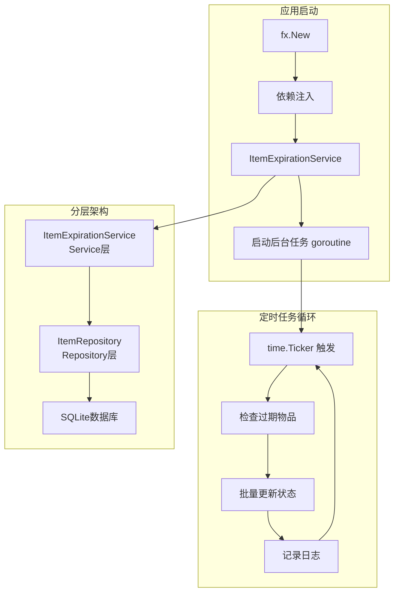
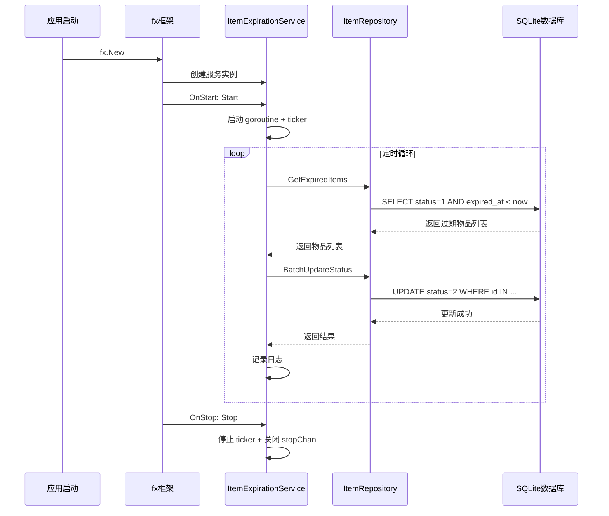
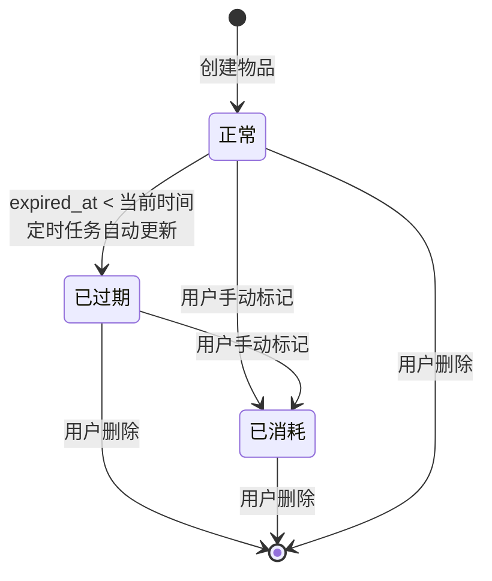

# 物品过期状态自动更新设计文档

> 本文档描述物品过期状态自动更新功能的技术设计方案，遵循 `Go-HTTP-后端项目开发规范.md` 的规范要求。

---

## 目录

1. [需求背景](#1-需求背景)
2. [问题分析](#2-问题分析)
3. [设计方案](#3-设计方案)
4. [架构设计](#4-架构设计)
5. [详细实现](#5-详细实现)
6. [配置设计](#6-配置设计)
7. [性能与并发](#7-性能与并发)
8. [测试方案](#8-测试方案)
9. [部署注意事项](#9-部署注意事项)

---

## 1. 需求背景

### 1.1 当前问题

当前系统中，物品（Item）有三种状态：

| 状态值 | 常量名 | 说明 |
|--------|--------|------|
| 1 | StatusNormal | 正常 |
| 2 | StatusExpired | 已过期 |
| 3 | StatusUsed | 已消耗 |

**核心问题**：物品在到达过期时间（`expired_at`）后，系统不会自动将状态从 `1`（正常）更新为 `2`（已过期）。

### 1.2 影响范围

1. **统计数据不准确**：`GetStats` 方法查询 `status=2` 的物品作为"已过期"，但实际上永远不会自动变成 `2`
2. **用户体验差**：用户需要手动刷新或等待下次查询才能看到过期状态
3. **提醒功能缺失**：虽然有 `remind_days` 字段，但没有实际的提醒机制

---

## 2. 问题分析

### 2.1 现有代码分析

#### 2.1.1 物品模型（[`internal/model/item.go`](internal/model/item.go)）

```go
type Item struct {
    ID          uint      `gorm:"primaryKey"`
    UserID      uint      `gorm:"index;not null"`
    CategoryID  uint      `gorm:"index;not null"`
    Name        string    `gorm:"size:200;not null"`
    Description string    `gorm:"size:500"`
    Quantity    int       `gorm:"default:1"`
    Unit        string    `gorm:"size:20"`
    ExpiredAt   time.Time `gorm:"index;not null"`  // 过期时间
    RemindDays  int       `gorm:"default:3"`        // 提前提醒天数
    Status      int8      `gorm:"default:1;index"`  // 状态：1正常 2已过期 3已消耗
    CreatedAt   time.Time
    UpdatedAt   time.Time
}
```

#### 2.1.2 统计查询逻辑（[`internal/repository/item.go:81-124`](internal/repository/item.go:81)）

```go
// expired: expired_at < 当前时间 且 status = 2（已过期）
// 这说明系统期望 status=2 表示已过期，但没有任何机制自动更新
```

#### 2.1.3 主入口（[`cmd/server/main.go`](cmd/server/main.go)）

- 使用 `fx` 依赖注入框架
- 没有任何后台任务或定时器
- 仅启动 HTTP 服务器

### 2.2 技术约束

根据项目开发规范，需要遵守：

1. **严格分层**：定时任务属于 Service 层职责
2. **面向接口**：定义接口，便于测试和替换
3. **配置外置**：定时任务间隔等参数通过配置文件管理
4. **依赖注入**：使用 `fx` 管理生命周期
5. **错误统一**：使用统一的错误处理机制

---

## 3. 设计方案

### 3.1 方案选型

| 方案 | 优点 | 缺点 | 结论 |
|------|------|------|------|
| **方案A：查询时动态判断** | 实现简单，无后台任务 | 每次查询都需要计算，性能差；状态字段失去意义 | ❌ 不采用 |
| **方案B：数据库触发器** | 数据库层面保证 | SQLite 触发器支持有限；违反分层原则 | ❌ 不采用 |
| **方案C：后台定时任务** | 性能好；符合分层原则；可配置 | 需要额外 goroutine | ✅ 采用 |

### 3.2 方案C详细说明

采用**后台定时任务**方案，核心思路：

1. 应用启动时，启动一个后台 goroutine
2. 使用 `time.Ticker` 定时触发检查
3. 每次检查：查询所有 `status=1` 且 `expired_at < 当前时间` 的物品
4. 批量更新这些物品的 `status=2`
5. 记录日志，便于监控

---

## 4. 架构设计

### 4.1 整体架构



### 4.2 新增组件

| 组件 | 层级 | 说明 |
|------|------|------|
| `ItemExpirationService` | Service | 过期检查服务，负责定时任务逻辑 |
| `IItemExpirationService` | Service | 接口定义 |
| `ExpirationConfig` | Config | 定时任务配置 |

### 4.3 目录结构变更

```
internal/
├── service/
│   ├── item.go                    # 现有文件
│   ├── item_expiration.go         # 新增：过期检查服务
│   └── item_validator.go          # 现有文件
├── repository/
│   ├── item.go                    # 现有文件（需添加方法）
│   └── ...
config/
├── config.go                      # 现有文件（需添加配置）
├── config.example.yaml            # 现有文件（需添加配置项）
```

---

## 5. 详细实现

### 5.1 配置设计

#### 5.1.1 配置结构（[`config/config.go`](config/config.go)）

```go
// ExpirationConfig 过期检查配置
type ExpirationConfig struct {
    Enabled      bool `mapstructure:"enabled"`        // 是否启用自动过期检查
    IntervalSec  int  `mapstructure:"interval_sec"`   // 检查间隔（秒）
    BatchSize    int  `mapstructure:"batch_size"`     // 每次批量处理数量
}
```

#### 5.1.2 配置文件示例（[`config/config.example.yaml`](config/config.example.yaml)）

```yaml
expiration:
  enabled: true           # 是否启用自动过期检查
  interval_sec: 3600      # 检查间隔（秒），默认1小时
  batch_size: 100         # 每次批量处理数量，防止一次性处理过多
```

### 5.2 Repository 层扩展

#### 5.2.1 接口扩展（[`internal/repository/item.go`](internal/repository/item.go)）

```go
// IItemRepository 物品仓储接口
type IItemRepository interface {
    Create(ctx context.Context, item *model.Item) error
    GetByID(ctx context.Context, id uint) (*model.Item, error)
    List(ctx context.Context, userID uint, req *dto.ItemListRequest) ([]*model.Item, int64, error)
    GetExpiring(ctx context.Context, userID uint, days int) ([]*model.Item, error)
    GetStats(ctx context.Context, userID uint) (total, expiringSoon, expired, used int64, err error)
    Update(ctx context.Context, item *model.Item) error
    Delete(ctx context.Context, id uint) error
    
    // 新增方法：过期检查相关
    GetExpiredItems(ctx context.Context, limit int) ([]*model.Item, error)  // 获取已过期但状态仍为正常的物品
    BatchUpdateStatus(ctx context.Context, ids []uint, status int8) error   // 批量更新状态
}
```

#### 5.2.2 实现方法

```go
// GetExpiredItems 获取已过期但状态仍为正常的物品
// 用于后台定时任务检查
func (r *ItemRepository) GetExpiredItems(ctx context.Context, limit int) ([]*model.Item, error) {
    var items []*model.Item
    now := utils.NowUTC()
    
    err := r.db.WithContext(ctx).
        Model(&model.Item{}).
        Where("status = ?", 1).           // 状态为正常
        Where("expired_at < ?", now).     // 已过期
        Limit(limit).                     // 限制数量，防止一次性处理过多
        Find(&items).Error
    
    if err != nil {
        return nil, err
    }
    
    return items, nil
}

// BatchUpdateStatus 批量更新物品状态
func (r *ItemRepository) BatchUpdateStatus(ctx context.Context, ids []uint, status int8) error {
    if len(ids) == 0 {
        return nil
    }
    
    return r.db.WithContext(ctx).
        Model(&model.Item{}).
        Where("id IN ?", ids).
        Update("status", status).Error
}
```

### 5.3 Service 层实现

#### 5.3.1 接口定义（[`internal/service/item_expiration.go`](internal/service/item_expiration.go)）

```go
package service

import (
    "context"
    
    "things-expired/internal/repository"
    "things-expired/pkg/utils"
)

// IItemExpirationService 物品过期检查服务接口
type IItemExpirationService interface {
    // Start 启动过期检查任务
    // 在应用启动时调用，启动后台 goroutine
    Start(ctx context.Context) error
    
    // Stop 停止过期检查任务
    // 在应用关闭时调用，优雅停止
    Stop() error
    
    // CheckExpiredItems 执行一次过期检查
    // 可用于手动触发或测试
    CheckExpiredItems(ctx context.Context) (int, error)
}
```

#### 5.3.2 服务实现

```go
package service

import (
    "context"
    "sync"
    "time"
    
    "things-expired/config"
    "things-expired/internal/model"
    "things-expired/internal/repository"
    "things-expired/pkg/utils"
    
    "go.uber.org/zap"
)

// 物品状态常量
const (
    StatusNormal  int8 = 1 // 正常
    StatusExpired int8 = 2 // 已过期
    StatusUsed    int8 = 3 // 已消耗
)

// ItemExpirationService 物品过期检查服务实现
type ItemExpirationService struct {
    itemRepo   repository.IItemRepository
    config     *config.ExpirationConfig
    logger     *utils.Logger
    ticker     *time.Ticker
    stopChan   chan struct{}
    running    bool
    mu         sync.Mutex
}

// NewItemExpirationService 创建过期检查服务
func NewItemExpirationService(
    itemRepo repository.IItemRepository,
    cfg *config.ExpirationConfig,
    logger *utils.Logger,
) IItemExpirationService {
    // 设置默认值
    if cfg.IntervalSec <= 0 {
        cfg.IntervalSec = 3600 // 默认1小时
    }
    if cfg.BatchSize <= 0 {
        cfg.BatchSize = 100 // 默认每次处理100条
    }
    
    return &ItemExpirationService{
        itemRepo: itemRepo,
        config:   cfg,
        logger:   logger,
        stopChan: make(chan struct{}),
        running:  false,
    }
}

// Start 启动过期检查任务
func (s *ItemExpirationService) Start(ctx context.Context) error {
    s.mu.Lock()
    defer s.mu.Unlock()
    
    if s.running {
        return nil // 已经在运行
    }
    
    if !s.config.Enabled {
        s.logger.Info("过期检查任务已禁用")
        return nil
    }
    
    // 创建定时器
    interval := time.Duration(s.config.IntervalSec) * time.Second
    s.ticker = time.NewTicker(interval)
    s.running = true
    
    // 启动后台 goroutine
    go s.run(ctx)
    
    s.logger.Info("过期检查任务已启动",
        zap.Int("interval_sec", s.config.IntervalSec),
        zap.Int("batch_size", s.config.BatchSize),
    )
    
    return nil
}

// run 后台任务主循环
func (s *ItemExpirationService) run(ctx context.Context) {
    // 启动时先执行一次
    s.checkOnce(ctx)
    
    for {
        select {
        case <-s.ticker.C:
            // 定时触发
            s.checkOnce(ctx)
        case <-s.stopChan:
            // 收到停止信号
            s.logger.Info("过期检查任务收到停止信号")
            return
        case <-ctx.Done():
            // 上下文取消（应用关闭）
            s.logger.Info("过期检查任务上下文已取消")
            return
        }
    }
}

// checkOnce 执行一次检查
func (s *ItemExpirationService) checkOnce(ctx context.Context) {
    count, err := s.CheckExpiredItems(ctx)
    if err != nil {
        s.logger.Error("过期检查失败", zap.Error(err))
        return
    }
    
    if count > 0 {
        s.logger.Info("过期检查完成",
            zap.Int("updated_count", count),
        )
    }
}

// CheckExpiredItems 执行一次过期检查
// 返回更新的物品数量
func (s *ItemExpirationService) CheckExpiredItems(ctx context.Context) (int, error) {
    // 1. 获取已过期但状态仍为正常的物品
    items, err := s.itemRepo.GetExpiredItems(ctx, s.config.BatchSize)
    if err != nil {
        return 0, err
    }
    
    if len(items) == 0 {
        return 0, nil
    }
    
    // 2. 收集需要更新的 ID
    ids := make([]uint, 0, len(items))
    for _, item := range items {
        ids = append(ids, item.ID)
    }
    
    // 3. 批量更新状态
    if err := s.itemRepo.BatchUpdateStatus(ctx, ids, StatusExpired); err != nil {
        return 0, err
    }
    
    return len(items), nil
}

// Stop 停止过期检查任务
func (s *ItemExpirationService) Stop() error {
    s.mu.Lock()
    defer s.mu.Unlock()
    
    if !s.running {
        return nil
    }
    
    // 停止定时器
    if s.ticker != nil {
        s.ticker.Stop()
    }
    
    // 发送停止信号
    close(s.stopChan)
    s.running = false
    
    s.logger.Info("过期检查任务已停止")
    
    return nil
}
```

### 5.4 fx 生命周期集成

#### 5.4.1 主入口修改（[`cmd/server/main.go`](cmd/server/main.go)）

```go
func main() {
    // ... 现有代码 ...
    
    fx.New(
        // ... 现有 Provider ...
        
        // 过期检查配置
        fx.Provide(func(cfg *config.Config) *config.ExpirationConfig {
            return &cfg.Expiration
        }),
        
        // 过期检查服务
        fx.Provide(service.NewItemExpirationService),
        
        // ... 现有 Provider ...
        
        // 启动服务器和过期检查任务
        fx.Invoke(startServer),
        fx.Invoke(startExpirationChecker),  // 新增
    ).Run()
}

// startExpirationChecker 启动过期检查任务
func startExpirationChecker(
    lc fx.Lifecycle,
    expirationSvc service.IItemExpirationService,
    logger *utils.Logger,
) {
    lc.Append(fx.Hook{
        OnStart: func(ctx context.Context) error {
            logger.Info("启动过期检查任务")
            return expirationSvc.Start(ctx)
        },
        OnStop: func(ctx context.Context) error {
            logger.Info("停止过期检查任务")
            return expirationSvc.Stop()
        },
    })
}
```

---

## 6. 配置设计

### 6.1 配置项说明

| 配置项 | 类型 | 默认值 | 说明 |
|--------|------|--------|------|
| `expiration.enabled` | bool | true | 是否启用自动过期检查 |
| `expiration.interval_sec` | int | 3600 | 检查间隔（秒），建议值：300-3600 |
| `expiration.batch_size` | int | 100 | 每次批量处理数量，防止一次性处理过多 |

### 6.2 配置建议

| 场景 | interval_sec | batch_size | 说明 |
|------|--------------|------------|------|
| 开发环境 | 60 | 50 | 快速验证，便于调试 |
| 生产环境（少量物品） | 3600 | 100 | 每小时检查一次 |
| 生产环境（大量物品） | 1800 | 200 | 每30分钟检查，批量处理更多 |

---

## 7. 性能与并发

### 7.1 性能优化措施

1. **批量处理**：每次最多处理 `batch_size` 条记录，避免一次性处理过多导致数据库压力
2. **索引利用**：`status` 和 `expired_at` 字段已有索引，查询效率高
3. **定时间隔**：可配置间隔，根据业务需求调整
4. **异步执行**：后台 goroutine 不阻塞主服务

### 7.2 并发安全

```go
type ItemExpirationService struct {
    // ...
    mu      sync.Mutex  // 保护 running 状态
    running bool        // 防止重复启动
}
```

- 使用 `sync.Mutex` 保护服务状态
- 防止重复启动或停止
- 优雅停止机制

### 7.3 资源消耗

| 资源 | 消耗 | 说明 |
|------|------|------|
| CPU | 极低 | 定时触发，大部分时间空闲 |
| 内存 | 极低 | 仅维护一个 goroutine 和 ticker |
| 数据库 | 低 | 每次最多 `batch_size` 条查询和更新 |

---

## 8. 测试方案

### 8.1 单元测试

```go
// 文件位置：internal/service/item_expiration_test.go

package service

import (
    "context"
    "testing"
    "time"
    
    "github.com/stretchr/testify/assert"
    "github.com/stretchr/testify/mock"
    
    "things-expired/config"
    "things-expired/internal/model"
    "things-expired/pkg/utils"
)

// MockItemRepository 模拟 Repository
type MockItemRepository struct {
    mock.Mock
}

func (m *MockItemRepository) GetExpiredItems(ctx context.Context, limit int) ([]*model.Item, error) {
    args := m.Called(ctx, limit)
    return args.Get(0).([]*model.Item), args.Error(1)
}

func (m *MockItemRepository) BatchUpdateStatus(ctx context.Context, ids []uint, status int8) error {
    args := m.Called(ctx, ids, status)
    return args.Error(0)
}

func TestItemExpirationService_CheckExpiredItems(t *testing.T) {
    // 准备 mock
    mockRepo := new(MockItemRepository)
    logger, _ := utils.NewLoggerWithConfig(&config.LogConfig{Level: "debug"})
    
    cfg := &config.ExpirationConfig{
        Enabled:     true,
        IntervalSec: 60,
        BatchSize:   100,
    }
    
    svc := NewItemExpirationService(mockRepo, cfg, logger)
    
    ctx := context.Background()
    
    // 模拟返回已过期物品
    expiredItems := []*model.Item{
        {ID: 1, Status: 1, ExpiredAt: time.Now().Add(-1 * time.Hour)},
        {ID: 2, Status: 1, ExpiredAt: time.Now().Add(-2 * time.Hour)},
    }
    
    mockRepo.On("GetExpiredItems", ctx, 100).Return(expiredItems, nil)
    mockRepo.On("BatchUpdateStatus", ctx, []uint{1, 2}, int8(2)).Return(nil)
    
    // 执行测试
    count, err := svc.CheckExpiredItems(ctx)
    
    // 断言
    assert.NoError(t, err)
    assert.Equal(t, 2, count)
    
    mockRepo.AssertExpectations(t)
}

func TestItemExpirationService_StartStop(t *testing.T) {
    mockRepo := new(MockItemRepository)
    logger, _ := utils.NewLoggerWithConfig(&config.LogConfig{Level: "debug"})
    
    cfg := &config.ExpirationConfig{
        Enabled:     true,
        IntervalSec: 1, // 1秒间隔，便于测试
        BatchSize:   10,
    }
    
    svc := NewItemExpirationService(mockRepo, cfg, logger)
    
    ctx := context.Background()
    
    // 模拟没有过期物品
    mockRepo.On("GetExpiredItems", ctx, 10).Return([]*model.Item{}, nil)
    
    // 启动
    err := svc.Start(ctx)
    assert.NoError(t, err)
    
    // 等待一小段时间
    time.Sleep(100 * time.Millisecond)
    
    // 停止
    err = svc.Stop()
    assert.NoError(t, err)
}
```

### 8.2 集成测试

```go
// 文件位置：internal/service/item_expiration_it_test.go

package service

import (
    "context"
    "testing"
    "time"
    
    "github.com/stretchr/testify/assert"
    
    "things-expired/config"
    "things-expired/internal/model"
    "things-expired/internal/repository"
    "things-expired/pkg/utils"
)

func TestItemExpirationService_Integration(t *testing.T) {
    // 使用真实数据库（测试数据库）
    cfg := &config.DatabaseConfig{
        Path: ":memory:", // SQLite 内存数据库
    }
    
    db, err := repository.NewDB(cfg)
    assert.NoError(t, err)
    
    // 自动迁移
    db.AutoMigrate(&model.Item{})
    
    // 创建测试数据
    now := time.Now().UTC()
    items := []*model.Item{
        {UserID: 1, CategoryID: 1, Name: "已过期物品1", Status: 1, ExpiredAt: now.Add(-1 * time.Hour)},
        {UserID: 1, CategoryID: 1, Name: "已过期物品2", Status: 1, ExpiredAt: now.Add(-2 * time.Hour)},
        {UserID: 1, CategoryID: 1, Name: "正常物品", Status: 1, ExpiredAt: now.Add(1 * time.Hour)},
    }
    
    for _, item := range items {
        db.Create(item)
    }
    
    // 创建服务
    itemRepo := repository.NewItemRepository(db)
    logger, _ := utils.NewLoggerWithConfig(&config.LogConfig{Level: "debug"})
    
    expCfg := &config.ExpirationConfig{
        Enabled:     true,
        IntervalSec: 60,
        BatchSize:   100,
    }
    
    svc := NewItemExpirationService(itemRepo, expCfg, logger)
    
    // 执行检查
    ctx := context.Background()
    count, err := svc.CheckExpiredItems(ctx)
    
    assert.NoError(t, err)
    assert.Equal(t, 2, count) // 应该更新2条
    
    // 验证状态已更新
    var expiredCount int64
    db.Model(&model.Item{}).Where("status = ?", 2).Count(&expiredCount)
    assert.Equal(t, int64(2), expiredCount)
}
```

---

## 9. 部署注意事项

### 9.1 配置建议

```yaml
# 生产环境配置示例
expiration:
  enabled: true
  interval_sec: 1800    # 每30分钟检查一次
  batch_size: 200       # 每次最多处理200条
```

### 9.2 监控建议

1. **日志监控**：关注过期检查日志，确认任务正常运行
2. **统计对比**：定期对比 `GetStats` 返回的 `expired` 数量与预期
3. **告警设置**：如果连续多次检查失败，应触发告警

### 9.3 多实例部署

如果部署多个实例（虽然当前项目是单实例设计），需要注意：

| 方案 | 说明 |
|------|------|
| 单实例运行 | 当前设计，简单可靠 |
| 分布式锁 | 多实例时需要引入分布式锁，避免重复检查 |
| 主备模式 | 只有一个实例运行定时任务，其他实例仅提供 API |

**当前项目建议**：单实例部署，无需额外处理。

---

## 附录

### A. 完整流程图



### B. 状态流转图



### C. 文件变更清单

| 文件 | 变更类型 | 说明 |
|------|----------|------|
| `config/config.go` | 修改 | 添加 `ExpirationConfig` 结构 |
| `config/config.example.yaml` | 修改 | 添加 `expiration` 配置项 |
| `internal/repository/item.go` | 修改 | 添加 `GetExpiredItems`、`BatchUpdateStatus` 方法 |
| `internal/service/item_expiration.go` | 新增 | 过期检查服务实现 |
| `internal/service/item_expiration_test.go` | 新增 | 单元测试 |
| `cmd/server/main.go` | 修改 | 添加 fx 生命周期钩子 |

---

## 总结

本设计文档描述了物品过期状态自动更新功能的完整实现方案：

1. **架构设计**：遵循分层架构，新增 `ItemExpirationService` 服务层组件
2. **技术实现**：使用 Go 标准库 `time.Ticker` 实现定时任务，通过 `fx` 管理生命周期
3. **性能优化**：批量处理、索引利用、可配置间隔
4. **并发安全**：使用 `sync.Mutex` 保护状态，优雅停止机制
5. **测试方案**：提供单元测试和集成测试示例

该方案完全遵循 `Go-HTTP-后端项目开发规范.md` 的规范要求，代码优雅、可维护性强。