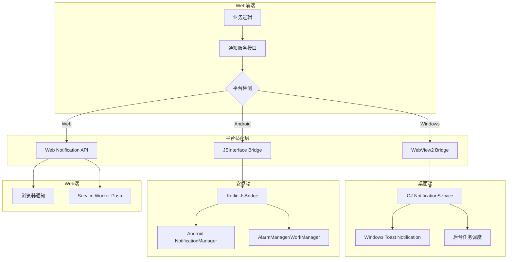
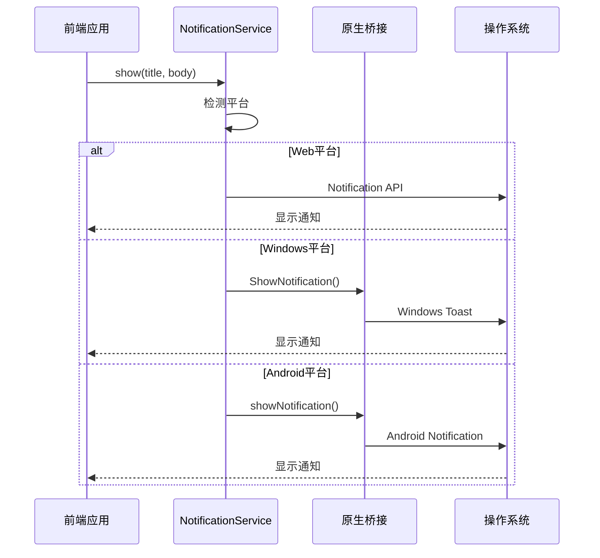
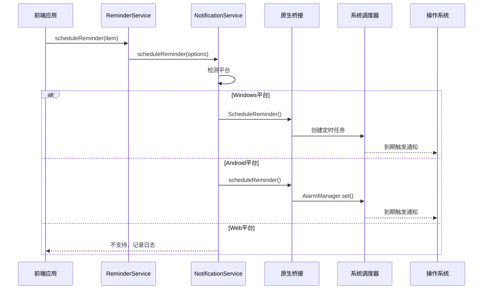
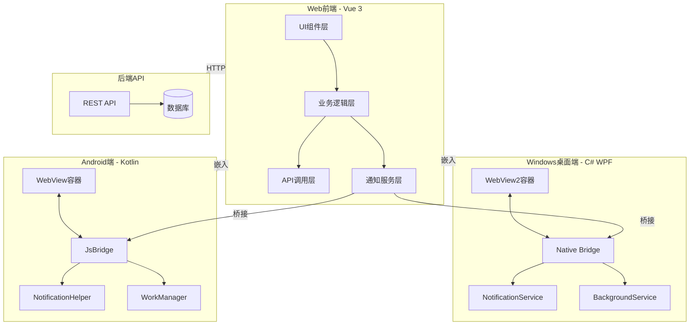

# ThingsExpired 跨平台应用技术方案

## 目录

1. [项目现状分析](#1-项目现状分析)
2. [桌面端技术方案](#2-桌面端技术方案)
3. [安卓端技术方案](#3-安卓端技术方案)
4. [Web端适配方案](#4-web端适配方案)
5. [跨平台通知方案](#5-跨平台通知方案)
6. [架构总览](#6-架构总览)
7. [实施路线图](#7-实施路线图)

---

## 1. 项目现状分析

### 1.1 技术栈概览

| 类别 | 技术 | 版本 |
|------|------|------|
| 框架 | Vue | 3.5.32 |
| 构建工具 | Vite | 7.3.2 |
| 状态管理 | Pinia | 3.0.4 |
| 路由 | Vue Router | 5.0.4 |
| UI组件库 | PrimeVue | 4.5.5 |
| CSS框架 | Tailwind CSS | 4.2.4 |
| 国际化 | vue-i18n | 11.3.2 |
| HTTP客户端 | Axios | 1.15.2 |
| 工具库 | @vueuse/core | 14.2.1 |
| 日期处理 | dayjs | 1.11.20 |

### 1.2 项目结构分析

```
src/
├── api/                    # API接口封装
│   ├── index.ts           # Axios实例与拦截器
│   ├── category.ts        # 分类API
│   ├── item.ts            # 物品API
│   └── user.ts            # 用户API
├── assets/styles/         # 全局样式
├── components/            # 公共组件
│   └── common/            # 通用组件(Button, Pagination)
├── composables/           # 组合式函数
│   ├── useAuth.ts         # 认证逻辑
│   ├── useFetch.ts        # 数据获取
│   └── useToast.ts        # 通知提示
├── layouts/               # 布局组件
│   ├── DefaultLayout.vue  # 默认布局(侧边栏+顶栏)
│   └── BlankLayout.vue    # 空白布局
├── locales/               # 国际化资源
├── router/                # 路由配置
├── stores/                # Pinia状态管理
│   ├── app/               # 应用状态(主题、语言)
│   └── user/              # 用户状态(认证、信息)
├── types/                 # TypeScript类型定义
├── utils/                 # 工具函数
└── views/                 # 页面视图
    ├── category/          # 分类管理
    ├── items/             # 物品管理
    ├── login/             # 登录注册
    └── setting/           # 设置页面
```

### 1.3 核心功能模块

#### 1.3.1 用户认证模块
- 登录/登出功能
- Token管理(存储于localStorage)
- 路由守卫保护
- 权限验证

#### 1.3.2 物品管理模块
- 物品CRUD操作
- 过期状态追踪(正常/已过期/已消耗)
- 分类管理
- 搜索过滤功能
- 分页展示

#### 1.3.3 通知提示模块
- 基于PrimeVue Toast的应用内通知
- 成功/错误/警告/信息四种类型

#### 1.3.4 主题与国际化
- 明/暗/自动三种主题模式
- 中/英文双语支持
- 响应式布局(桌面端/移动端)

### 1.4 现有通知机制分析

当前项目使用PrimeVue的Toast组件实现应用内通知：

```typescript
// src/composables/useToast.ts
export function useToast() {
  const toast = usePrimeToast()
  
  function success(detail: string, summary: string = '成功', life: number = 3000) {
    toast.add({ severity: 'success', summary, detail, life })
  }
  // ... error, warn, info 等方法
}
```

**局限性**：
- 仅支持应用内通知，应用关闭后无法推送
- 依赖浏览器环境，无法调用原生通知API
- 无后台任务调度能力

---

## 2. 桌面端技术方案

### 2.1 技术选型

#### 2.1.1 框架选择：WPF + WebView2

| 方案 | 优点 | 缺点 | 推荐度 |
|------|------|------|--------|
| **WPF + WebView2** | 成熟稳定、性能好、原生通知支持、.NET生态丰富 | 仅支持Windows | ⭐⭐⭐⭐⭐ |
| WinUI 3 + WebView2 | 现代化UI、支持Windows 11 | 生态较新、兼容性有限 | ⭐⭐⭐⭐ |
| Electron | 跨平台 | 资源占用大、需要Node.js | ⭐⭐⭐ |
| Avalonia + WebView | 跨平台 | WebView支持不完善 | ⭐⭐⭐ |

**推荐方案：WPF + WebView2**

理由：
1. WebView2基于Chromium，与Web端渲染一致
2. 原生支持Windows通知系统
3. 可直接调用.NET API实现后台任务
4. 与现有C#技术栈契合

#### 2.1.2 核心依赖

```xml
<!-- NuGet包 -->
<PackageReference Include="Microsoft.Web.WebView2" Version="1.0.2210.55" />
<PackageReference Include="Microsoft.Toolkit.Uwp.Notifications" Version="7.1.3" />
<PackageReference Include="Hardcodet.NotifyIcon.Wpf" Version="1.1.0" />
```

### 2.2 项目架构

```
ThingsExpired.Desktop/
├── ThingsExpired.Desktop.sln
├── src/
│   ├── ThingsExpired.App/              # 主应用项目
│   │   ├── App.xaml                    # 应用入口
│   │   ├── App.xaml.cs
│   │   ├── MainWindow.xaml             # 主窗口(包含WebView2)
│   │   ├── MainWindow.xaml.cs
│   │   ├── Views/
│   │   │   └── TrayIcon.xaml          # 系统托盘
│   │   ├── Services/
│   │   │   ├── NotificationService.cs  # 原生通知服务
│   │   │   ├── BridgeService.cs        # JS桥接服务
│   │   │   └── BackgroundService.cs    # 后台任务服务
│   │   ├── Models/
│   │   │   └── NotificationPayload.cs  # 通知数据模型
│   │   └── Helpers/
│   │       └── WebAssetLoader.cs       # Web资源加载器
│   │
│   └── ThingsExpired.Core/             # 核心库(可选)
│       ├── Interfaces/
│       │   └── INotification.cs
│       └── Models/
│           └── Item.cs
│
└── assets/
    └── icon.ico                        # 应用图标
```

### 2.3 WebView2集成方案

#### 2.3.1 主窗口实现

```csharp
// MainWindow.xaml.cs
public partial class MainWindow : Window
{
    public MainWindow()
    {
        InitializeComponent();
        InitializeWebView();
    }

    private async void InitializeWebView()
    {
        await webView.EnsureCoreWebView2Async();
        
        // 加载Web应用
        var htmlPath = GetWebAppPath();
        webView.Source = new Uri(htmlPath);
        
        // 注册桥接对象
        webView.CoreWebView2.AddHostObjectToScript("nativeBridge", new BridgeService());
        
        // 配置开发者工具(调试模式)
        #if DEBUG
        webView.CoreWebView2.OpenDevToolsWindow();
        #endif
    }

    private string GetWebAppPath()
    {
        // 优先使用本地打包资源
        var localPath = Path.Combine(AppDomain.CurrentDomain.BaseDirectory, "webapp", "index.html");
        if (File.Exists(localPath))
        {
            return localPath;
        }
        
        // 回退到远程服务器
        return "https://your-domain.com";
    }
}
```

#### 2.3.2 Web资源打包策略

```xml
<!-- 项目文件配置 -->
<ItemGroup>
  <Content Include="webapp\**\*.*">
    <CopyToOutputDirectory>PreserveNewest</CopyToOutputDirectory>
  </Content>
</ItemGroup>
```

打包流程：
1. 执行 `pnpm build` 生成 `dist` 目录
2. 将 `dist` 目录内容复制到桌面端项目的 `webapp` 目录
3. 编译桌面端应用时自动包含Web资源

### 2.4 原生通知实现

#### 2.4.1 Windows通知服务

```csharp
// Services/NotificationService.cs
using Microsoft.Toolkit.Uwp.Notifications;
using Windows.Data.Xml.Dom;
using Windows.UI.Notifications;

public class NotificationService
{
    public void ShowNotification(string title, string message, string iconPath = null)
    {
        var toastContent = new ToastContentBuilder()
            .AddText(title)
            .AddText(message)
            .AddAppLogoOverride(new Uri(iconPath ?? GetDefaultIcon()))
            .AddButton(new ToastButton()
                .SetContent("查看详情")
                .AddArgument("action", "viewItem"))
            .GetToastContent();

        var toast = new ToastNotification(toastContent.GetXml());
        ToastNotificationManager.CreateToastNotifier().Show(toast);
    }

    public void ScheduleNotification(string title, string message, DateTime scheduledTime)
    {
        var toastContent = new ToastContentBuilder()
            .AddText(title)
            .AddText(message)
            .GetToastContent();

        var scheduledToast = new ScheduledToastNotification(
            toastContent.GetXml(),
            scheduledTime
        );
        
        ToastNotificationManager.CreateToastNotifier().AddToSchedule(scheduledToast);
    }
}
```

#### 2.4.2 后台任务调度

```csharp
// Services/BackgroundService.cs
public class BackgroundService : IDisposable
{
    private Timer _checkTimer;
    private readonly NotificationService _notificationService;
    private readonly HttpClient _httpClient;

    public BackgroundService()
    {
        _notificationService = new NotificationService();
        _httpClient = new HttpClient();
    }

    public void Start()
    {
        // 每小时检查一次过期物品
        _checkTimer = new Timer(CheckExpiringItems, null, TimeSpan.Zero, TimeSpan.FromHours(1));
    }

    private async void CheckExpiringItems(object state)
    {
        try
        {
            // 调用API获取即将过期的物品
            var items = await FetchExpiringItems();
            
            foreach (var item in items)
            {
                _notificationService.ShowNotification(
                    "物品即将过期",
                    $"{item.Name} 将在 {item.RemainingDays} 天后过期"
                );
            }
        }
        catch (Exception ex)
        {
            // 错误处理
        }
    }

    public void Dispose()
    {
        _checkTimer?.Dispose();
    }
}
```

### 2.5 JS桥接通信

#### 2.5.1 桥接服务实现

```csharp
// Services/BridgeService.cs
[ClassInterface(ClassInterfaceType.AutoDual)]
[ComVisible(true)]
public class BridgeService
{
    private readonly NotificationService _notificationService = new();

    public string GetPlatform()
    {
        return "windows-desktop";
    }

    public void ShowNotification(string title, string message)
    {
        _notificationService.ShowNotification(title, message);
    }

    public void ScheduleReminder(int itemId, string itemName, DateTime expiredAt, int remindDays)
    {
        var remindTime = expiredAt.AddDays(-remindDays);
        _notificationService.ScheduleNotification(
            "物品过期提醒",
            $"{itemName} 即将过期",
            remindTime
        );
    }

    public string GetAppVersion()
    {
        return Assembly.GetExecutingAssembly().GetName().Version?.ToString() ?? "1.0.0";
    }
}
```

#### 2.5.2 前端调用示例

```typescript
// 前端检测平台并调用原生能力
declare global {
    interface Window {
        chrome: {
            webview: {
                hostObjects: {
                    nativeBridge: {
                        GetPlatform: () => string
                        ShowNotification: (title: string, message: string) => void
                        ScheduleReminder: (itemId: number, itemName: string, expiredAt: string, remindDays: number) => void
                    }
                }
            }
        }
    }
}

export function isDesktopApp(): boolean {
    return !!window.chrome?.webview?.hostObjects?.nativeBridge
}

export async function showNativeNotification(title: string, message: string) {
    if (isDesktopApp()) {
        await window.chrome.webview.hostObjects.nativeBridge.ShowNotification(title, message)
    } else {
        // 回退到Web Notification API
        new Notification(title, { body: message })
    }
}
```

---

## 3. 安卓端技术方案

### 3.1 技术选型

#### 3.1.1 框架选择：原生Kotlin + WebView

| 方案 | 优点 | 缺点 | 推荐度 |
|------|------|------|--------|
| **原生Kotlin + WebView** | 性能最优、原生通知支持、完全控制 | 需要Android开发经验 | ⭐⭐⭐⭐⭐ |
| Jetpack Compose + WebView | 现代化UI、声明式开发 | 学习曲线较陡 | ⭐⭐⭐⭐ |
| React Native WebView | 跨平台、JavaScript生态 | 性能略逊、包体积大 | ⭐⭐⭐ |
| Flutter WebView | 跨平台、UI一致性好 | 需要Dart语言、包体积大 | ⭐⭐⭐ |
| Capacitor | 前端友好、插件丰富 | 性能一般、定制性差 | ⭐⭐⭐ |

**推荐方案：原生Kotlin + WebView**

理由：
1. 完全控制原生通知系统
2. 可实现后台服务和定时任务
3. 最小的应用体积
4. 最佳的性能表现

#### 3.1.2 核心依赖

```kotlin
// build.gradle.kts (Module: app)
dependencies {
    // AndroidX核心库
    implementation("androidx.core:core-ktx:1.12.0")
    implementation("androidx.appcompat:appcompat:1.6.1")
    implementation("androidx.webkit:webkit:1.9.0")
    
    // 协程
    implementation("org.jetbrains.kotlinx:kotlinx-coroutines-android:1.7.3")
    
    // WorkManager (后台任务)
    implementation("androidx.work:work-runtime-ktx:2.9.0")
    
    // DataStore (本地存储)
    implementation("androidx.datastore:datastore-preferences:1.0.0")
    
    // 网络请求
    implementation("com.squareup.okhttp3:okhttp:4.12.0")
    implementation("com.squareup.okhttp3:logging-interceptor:4.12.0")
    
    // JSON解析
    implementation("com.google.code.gson:gson:2.10.1")
}
```

### 3.2 项目架构

```
ThingsExpired.Android/
├── app/
│   ├── src/
│   │   ├── main/
│   │   │   ├── java/com/thingsexpired/app/
│   │   │   │   ├── MainActivity.kt           # 主Activity
│   │   │   │   ├── App.kt                    # Application类
│   │   │   │   │
│   │   │   │   ├── webview/
│   │   │   │   │   ├── WebViewFragment.kt   # WebView容器
│   │   │   │   │   ├── JsBridge.kt          # JS桥接
│   │   │   │   │   └── WebViewClient.kt     # WebView客户端
│   │   │   │   │
│   │   │   │   ├── notification/
│   │   │   │   │   ├── NotificationHelper.kt # 通知工具类
│   │   │   │   │   └── NotificationChannel.kt # 通知渠道
│   │   │   │   │
│   │   │   │   ├── service/
│   │   │   │   │   ├── ExpiryCheckWorker.kt # 后台检查Worker
│   │   │   │   │   └── ApiService.kt        # API服务
│   │   │   │   │
│   │   │   │   ├── bridge/
│   │   │   │   │   ├── NativeBridge.kt      # 原生桥接接口
│   │   │   │   │   └── BridgeCommand.kt      # 桥接命令
│   │   │   │   │
│   │   │   │   └── util/
│   │   │   │       ├── AssetLoader.kt       # 资源加载器
│   │   │   │       └── PreferenceManager.kt # 偏好设置
│   │   │   │
│   │   │   ├── assets/
│   │   │   │   └── webapp/                  # Web应用资源
│   │   │   │       ├── index.html
│   │   │   │       ├── assets/
│   │   │   │       └── ...
│   │   │   │
│   │   │   ├── res/
│   │   │   │   ├── layout/
│   │   │   │   │   └── activity_main.xml
│   │   │   │   ├── values/
│   │   │   │   │   └── strings.xml
│   │   │   │   └── drawable/
│   │   │   │       └── ic_notification.xml
│   │   │   │
│   │   │   └── AndroidManifest.xml
│   │   │
│   │   └── test/                            # 单元测试
│   │
│   └── build.gradle.kts
│
└── build.gradle.kts                         # 项目级配置
```

### 3.3 WebView集成方案

#### 3.3.1 主Activity实现

```kotlin
// MainActivity.kt
class MainActivity : AppCompatActivity() {
    
    private lateinit var webView: WebView
    private lateinit var jsBridge: JsBridge
    
    override fun onCreate(savedInstanceState: Bundle?) {
        super.onCreate(savedInstanceState)
        setContentView(R.layout.activity_main)
        
        setupWebView()
        setupNotificationChannel()
        scheduleBackgroundCheck()
    }
    
    private fun setupWebView() {
        webView = findViewById(R.id.webView)
        jsBridge = JsBridge(this)
        
        webView.settings.apply {
            javaScriptEnabled = true
            domStorageEnabled = true
            databaseEnabled = true
            allowFileAccess = true
            mixedContentMode = WebSettings.MIXED_CONTENT_ALWAYS_ALLOW
        }
        
        // 添加JS接口
        webView.addJavascriptInterface(jsBridge, "AndroidBridge")
        
        // 设置WebViewClient
        webView.webViewClient = object : WebViewClient() {
            override fun shouldOverrideUrlLoading(view: WebView?, url: String?): Boolean {
                // 处理外部链接
                return false
            }
            
            override fun onPageFinished(view: WebView?, url: String?) {
                super.onPageFinished(view, url)
                // 注入平台标识
                webView.evaluateJavascript("window.__PLATFORM__ = 'android';", null)
            }
        }
        
        // 加载Web应用
        loadWebApp()
    }
    
    private fun loadWebApp() {
        // 优先加载本地资源
        if (hasLocalAssets()) {
            webView.loadUrl("file:///android_asset/webapp/index.html")
        } else {
            webView.loadUrl("https://your-domain.com")
        }
    }
    
    private fun hasLocalAssets(): Boolean {
        return try {
            assets.list("webapp")?.isNotEmpty() == true
        } catch (e: Exception) {
            false
        }
    }
    
    override fun onBackPressed() {
        if (webView.canGoBack()) {
            webView.goBack()
        } else {
            super.onBackPressed()
        }
    }
}
```

#### 3.3.2 JS桥接实现

```kotlin
// JsBridge.kt
class JsBridge(private val context: Context) {
    
    private val notificationHelper = NotificationHelper(context)
    private val gson = Gson()
    
    @JavascriptInterface
    fun getPlatform(): String {
        return "android"
    }
    
    @JavascriptInterface
    fun showNotification(title: String, message: String) {
        notificationHelper.showNotification(title, message)
    }
    
    @JavascriptInterface
    fun scheduleReminder(itemId: Int, itemName: String, expiredAt: String, remindDays: Int) {
        val expiredDate = LocalDateTime.parse(expiredAt, DateTimeFormatter.ISO_DATE_TIME)
        val remindTime = expiredDate.minusDays(remindDays.toLong())
        
        // 使用AlarmManager或WorkManager调度通知
        notificationHelper.scheduleNotification(
            notificationId = itemId,
            title = "物品过期提醒",
            message = "$itemName 即将过期",
            triggerTime = remindTime
        )
    }
    
    @JavascriptInterface
    fun cancelReminder(itemId: Int) {
        notificationHelper.cancelNotification(itemId)
    }
    
    @JavascriptInterface
    fun getAppVersion(): String {
        return try {
            val pInfo = context.packageManager.getPackageInfo(context.packageName, 0)
            pInfo.versionName ?: "1.0.0"
        } catch (e: Exception) {
            "1.0.0"
        }
    }
    
    @JavascriptInterface
    fun getDeviceId(): String {
        // 获取设备唯一标识
        return Settings.Secure.getString(
            context.contentResolver,
            Settings.Secure.ANDROID_ID
        )
    }
}
```

### 3.4 原生通知实现

#### 3.4.1 通知渠道配置

```kotlin
// notification/NotificationChannel.kt
object NotificationChannels {
    const val CHANNEL_ID_EXPIRY = "expiry_reminder"
    const val CHANNEL_ID_GENERAL = "general"
    
    fun createChannels(context: Context) {
        if (Build.VERSION.SDK_INT >= Build.VERSION_CODES.O) {
            val notificationManager = context.getSystemService(NotificationManager::class.java)
            
            // 过期提醒渠道
            val expiryChannel = NotificationChannel(
                CHANNEL_ID_EXPIRY,
                "过期提醒",
                NotificationManager.IMPORTANCE_HIGH
            ).apply {
                description = "物品过期提醒通知"
                enableLights(true)
                lightColor = Color.RED
                enableVibration(true)
                vibrationPattern = longArrayOf(0, 500, 200, 500)
            }
            
            // 通用通知渠道
            val generalChannel = NotificationChannel(
                CHANNEL_ID_GENERAL,
                "通用通知",
                NotificationManager.IMPORTANCE_DEFAULT
            ).apply {
                description = "应用通用通知"
            }
            
            notificationManager.createNotificationChannels(listOf(expiryChannel, generalChannel))
        }
    }
}
```

#### 3.4.2 通知工具类

```kotlin
// notification/NotificationHelper.kt
class NotificationHelper(private val context: Context) {
    
    private val notificationManager = context.getSystemService(Context.NOTIFICATION_SERVICE) as NotificationManager
    private val alarmManager = context.getSystemService(Context.ALARM_SERVICE) as AlarmManager
    
    fun showNotification(title: String, message: String, notificationId: Int = System.currentTimeMillis().toInt()) {
        val intent = Intent(context, MainActivity::class.java).apply {
            flags = Intent.FLAG_ACTIVITY_NEW_TASK or Intent.FLAG_ACTIVITY_CLEAR_TASK
        }
        
        val pendingIntent = PendingIntent.getActivity(
            context, 0, intent,
            PendingIntent.FLAG_IMMUTABLE or PendingIntent.FLAG_UPDATE_CURRENT
        )
        
        val notification = NotificationCompat.Builder(context, NotificationChannels.CHANNEL_ID_GENERAL)
            .setSmallIcon(R.drawable.ic_notification)
            .setContentTitle(title)
            .setContentText(message)
            .setPriority(NotificationCompat.PRIORITY_HIGH)
            .setAutoCancel(true)
            .setContentIntent(pendingIntent)
            .build()
        
        notificationManager.notify(notificationId, notification)
    }
    
    fun scheduleNotification(
        notificationId: Int,
        title: String,
        message: String,
        triggerTime: LocalDateTime
    ) {
        val intent = Intent(context, NotificationReceiver::class.java).apply {
            putExtra("notificationId", notificationId)
            putExtra("title", title)
            putExtra("message", message)
        }
        
        val pendingIntent = PendingIntent.getBroadcast(
            context, notificationId, intent,
            PendingIntent.FLAG_IMMUTABLE or PendingIntent.FLAG_UPDATE_CURRENT
        )
        
        val triggerAtMillis = triggerTime.atZone(ZoneId.systemDefault()).toInstant().toEpochMilli()
        
        if (Build.VERSION.SDK_INT >= Build.VERSION_CODES.S) {
            if (alarmManager.canScheduleExactAlarms()) {
                alarmManager.setExactAndAllowWhileIdle(
                    AlarmManager.RTC_WAKEUP,
                    triggerAtMillis,
                    pendingIntent
                )
            } else {
                // 使用非精确闹钟
                alarmManager.set(
                    AlarmManager.RTC_WAKEUP,
                    triggerAtMillis,
                    pendingIntent
                )
            }
        } else {
            alarmManager.setExactAndAllowWhileIdle(
                AlarmManager.RTC_WAKEUP,
                triggerAtMillis,
                pendingIntent
            )
        }
    }
    
    fun cancelNotification(notificationId: Int) {
        val intent = Intent(context, NotificationReceiver::class.java)
        val pendingIntent = PendingIntent.getBroadcast(
            context, notificationId, intent,
            PendingIntent.FLAG_IMMUTABLE
        )
        alarmManager.cancel(pendingIntent)
        notificationManager.cancel(notificationId)
    }
}

// NotificationReceiver.kt
class NotificationReceiver : BroadcastReceiver() {
    override fun onReceive(context: Context, intent: Intent) {
        val notificationId = intent.getIntExtra("notificationId", 0)
        val title = intent.getStringExtra("title") ?: "提醒"
        val message = intent.getStringExtra("message") ?: ""
        
        NotificationHelper(context).showNotification(title, message, notificationId)
    }
}
```

### 3.5 后台任务调度

```kotlin
// service/ExpiryCheckWorker.kt
class ExpiryCheckWorker(
    context: Context,
    params: WorkerParameters
) : CoroutineWorker(context, params) {
    
    private val apiService = ApiService()
    private val notificationHelper = NotificationHelper(context)
    private val preferenceManager = PreferenceManager(context)
    
    override suspend fun doWork(): Result {
        return try {
            // 检查用户是否已登录
            val token = preferenceManager.getToken()
            if (token.isNullOrEmpty()) {
                return Result.success()
            }
            
            // 获取即将过期的物品
            val expiringItems = apiService.getExpiringItems(token)
            
            // 发送通知
            expiringItems.forEach { item ->
                notificationHelper.showNotification(
                    notificationId = item.id,
                    title = "物品即将过期",
                    message = "${item.name} 将在 ${item.remainingDays} 天后过期"
                )
            }
            
            Result.success()
        } catch (e: Exception) {
            Log.e("ExpiryCheckWorker", "检查过期物品失败", e)
            Result.retry()
        }
    }
    
    companion object {
        const val WORK_NAME = "expiry_check_work"
        
        fun schedule(context: Context) {
            val periodicWorkRequest = PeriodicWorkRequestBuilder<ExpiryCheckWorker>(
                24, TimeUnit.HOURS,  // 每24小时执行一次
                1, TimeUnit.HOURS   // 弹性时间1小时
            )
                .setConstraints(
                    Constraints.Builder()
                        .setRequiredNetworkType(NetworkType.CONNECTED)
                        .setRequiresBatteryNotLow(true)
                        .build()
                )
                .build()
            
            WorkManager.getInstance(context).enqueueUniquePeriodicWork(
                WORK_NAME,
                ExistingPeriodicWorkPolicy.KEEP,
                periodicWorkRequest
            )
        }
    }
}
```

---

## 4. Web端适配方案

### 4.1 平台检测与适配

#### 4.1.1 平台检测工具

```typescript
// src/utils/platform.ts

/**
 * 运行平台类型
 */
export type Platform = 'web' | 'windows' | 'android'

/**
 * 平台检测器
 */
export class PlatformDetector {
    private static _platform: Platform | null = null
    
    /**
     * 获取当前平台
     */
    static getPlatform(): Platform {
        if (this._platform) {
            return this._platform
        }
        
        // 检测Windows桌面端
        if (this.isWindowsDesktop()) {
            this._platform = 'windows'
            return 'windows'
        }
        
        // 检测Android端
        if (this.isAndroidApp()) {
            this._platform = 'android'
            return 'android'
        }
        
        this._platform = 'web'
        return 'web'
    }
    
    /**
     * 检测是否为Windows桌面应用
     */
    static isWindowsDesktop(): boolean {
        return !!(window as any).chrome?.webview?.hostObjects?.nativeBridge
    }
    
    /**
     * 检测是否为Android应用
     */
    static isAndroidApp(): boolean {
        return !!(window as any).AndroidBridge
    }
    
    /**
     * 检测是否为移动端
     */
    static isMobile(): boolean {
        return /Android|webOS|iPhone|iPad|iPod|BlackBerry|IEMobile|Opera Mini/i.test(
            navigator.userAgent
        )
    }
    
    /**
     * 检测是否支持原生通知
     */
    static supportsNativeNotification(): boolean {
        return this.getPlatform() !== 'web'
    }
}

/**
 * 获取平台桥接对象
 */
export function getNativeBridge(): any {
    const platform = PlatformDetector.getPlatform()
    
    if (platform === 'windows') {
        return (window as any).chrome?.webview?.hostObjects?.nativeBridge
    }
    
    if (platform === 'android') {
        return (window as any).AndroidBridge
    }
    
    return null
}
```

### 4.2 统一通知接口

#### 4.2.1 通知服务抽象

```typescript
// src/services/notification/types.ts

/**
 * 通知选项
 */
export interface NotificationOptions {
    /** 通知标题 */
    title: string
    /** 通知内容 */
    body: string
    /** 通知图标 */
    icon?: string
    /** 通知标签(用于替换相同标签的通知) */
    tag?: string
    /** 点击通知后的跳转路径 */
    clickUrl?: string
}

/**
 * 定时提醒选项
 */
export interface ReminderOptions {
    /** 物品ID */
    itemId: number
    /** 物品名称 */
    itemName: string
    /** 过期时间 */
    expiredAt: Date
    /** 提前提醒天数 */
    remindDays: number
}

/**
 * 通知服务接口
 */
export interface INotificationService {
    /** 当前平台 */
    readonly platform: Platform
    
    /** 是否支持原生通知 */
    readonly isSupported: boolean
    
    /**
     * 显示即时通知
     */
    show(options: NotificationOptions): Promise<void>
    
    /**
     * 调度定时提醒
     */
    scheduleReminder(options: ReminderOptions): Promise<void>
    
    /**
     * 取消提醒
     */
    cancelReminder(itemId: number): Promise<void>
    
    /**
     * 请求通知权限
     */
    requestPermission(): Promise<boolean>
    
    /**
     * 检查是否有通知权限
     */
    hasPermission(): Promise<boolean>
}
```

#### 4.2.2 Web通知实现

```typescript
// src/services/notification/webNotification.ts

import type { INotificationService, NotificationOptions, ReminderOptions } from './types'
import { Platform } from '@/utils/platform'

/**
 * Web通知服务
 * 使用浏览器Notification API
 */
export class WebNotificationService implements INotificationService {
    readonly platform: Platform = 'web'
    readonly isSupported: boolean
    
    constructor() {
        this.isSupported = 'Notification' in window
    }
    
    async show(options: NotificationOptions): Promise<void> {
        if (!this.isSupported) {
            console.warn('浏览器不支持Notification API')
            return
        }
        
        const hasPermission = await this.requestPermission()
        if (!hasPermission) {
            console.warn('未获得通知权限')
            return
        }
        
        const notification = new Notification(options.title, {
            body: options.body,
            icon: options.icon || '/favicon.ico',
            tag: options.tag,
        })
        
        if (options.clickUrl) {
            notification.onclick = () => {
                window.focus()
                window.location.href = options.clickUrl!
                notification.close()
            }
        }
    }
    
    async scheduleReminder(_options: ReminderOptions): Promise<void> {
        // Web端不支持后台定时提醒，需要依赖Service Worker
        console.warn('Web端不支持后台定时提醒，请使用Service Worker实现')
        
        // 可以使用Service Worker + Push API实现
        // 但需要后端支持
    }
    
    async cancelReminder(_itemId: number): Promise<void> {
        // Web端无法取消已调度的提醒
        console.warn('Web端无法取消已调度的提醒')
    }
    
    async requestPermission(): Promise<boolean> {
        if (!this.isSupported) {
            return false
        }
        
        if (Notification.permission === 'granted') {
            return true
        }
        
        if (Notification.permission === 'denied') {
            return false
        }
        
        const permission = await Notification.requestPermission()
        return permission === 'granted'
    }
    
    async hasPermission(): Promise<boolean> {
        return Notification.permission === 'granted'
    }
}
```

#### 4.2.3 Windows桌面通知实现

```typescript
// src/services/notification/windowsNotification.ts

import type { INotificationService, NotificationOptions, ReminderOptions } from './types'
import { PlatformDetector, getNativeBridge } from '@/utils/platform'

/**
 * Windows桌面通知服务
 * 通过WebView2桥接调用原生通知
 */
export class WindowsNotificationService implements INotificationService {
    readonly platform = 'windows' as const
    readonly isSupported: boolean
    private bridge: any
    
    constructor() {
        this.isSupported = PlatformDetector.isWindowsDesktop()
        this.bridge = getNativeBridge()
    }
    
    async show(options: NotificationOptions): Promise<void> {
        if (!this.isSupported || !this.bridge) {
            console.warn('Windows原生通知不可用')
            return
        }
        
        try {
            await this.bridge.ShowNotification(options.title, options.body)
        } catch (error) {
            console.error('显示Windows通知失败:', error)
        }
    }
    
    async scheduleReminder(options: ReminderOptions): Promise<void> {
        if (!this.isSupported || !this.bridge) {
            console.warn('Windows原生通知不可用')
            return
        }
        
        try {
            await this.bridge.ScheduleReminder(
                options.itemId,
                options.itemName,
                options.expiredAt.toISOString(),
                options.remindDays
            )
        } catch (error) {
            console.error('调度Windows提醒失败:', error)
        }
    }
    
    async cancelReminder(itemId: number): Promise<void> {
        if (!this.isSupported || !this.bridge) {
            return
        }
        
        try {
            await this.bridge.CancelReminder(itemId)
        } catch (error) {
            console.error('取消Windows提醒失败:', error)
        }
    }
    
    async requestPermission(): Promise<boolean> {
        // Windows桌面应用默认有通知权限
        return true
    }
    
    async hasPermission(): Promise<boolean> {
        return true
    }
}
```

#### 4.2.4 Android通知实现

```typescript
// src/services/notification/androidNotification.ts

import type { INotificationService, NotificationOptions, ReminderOptions } from './types'
import { PlatformDetector, getNativeBridge } from '@/utils/platform'

/**
 * Android通知服务
 * 通过WebView桥接调用原生通知
 */
export class AndroidNotificationService implements INotificationService {
    readonly platform = 'android' as const
    readonly isSupported: boolean
    private bridge: any
    
    constructor() {
        this.isSupported = PlatformDetector.isAndroidApp()
        this.bridge = getNativeBridge()
    }
    
    async show(options: NotificationOptions): Promise<void> {
        if (!this.isSupported || !this.bridge) {
            console.warn('Android原生通知不可用')
            return
        }
        
        try {
            this.bridge.showNotification(options.title, options.body)
        } catch (error) {
            console.error('显示Android通知失败:', error)
        }
    }
    
    async scheduleReminder(options: ReminderOptions): Promise<void> {
        if (!this.isSupported || !this.bridge) {
            console.warn('Android原生通知不可用')
            return
        }
        
        try {
            this.bridge.scheduleReminder(
                options.itemId,
                options.itemName,
                options.expiredAt.toISOString(),
                options.remindDays
            )
        } catch (error) {
            console.error('调度Android提醒失败:', error)
        }
    }
    
    async cancelReminder(itemId: number): Promise<void> {
        if (!this.isSupported || !this.bridge) {
            return
        }
        
        try {
            this.bridge.cancelReminder(itemId)
        } catch (error) {
            console.error('取消Android提醒失败:', error)
        }
    }
    
    async requestPermission(): Promise<boolean> {
        // Android应用在安装时已请求权限
        return true
    }
    
    async hasPermission(): Promise<boolean> {
        return true
    }
}
```

#### 4.2.5 统一通知服务工厂

```typescript
// src/services/notification/index.ts

import type { INotificationService } from './types'
import { PlatformDetector } from '@/utils/platform'
import { WebNotificationService } from './webNotification'
import { WindowsNotificationService } from './windowsNotification'
import { AndroidNotificationService } from './androidNotification'

/**
 * 通知服务实例(单例)
 */
let notificationService: INotificationService | null = null

/**
 * 获取通知服务实例
 */
export function getNotificationService(): INotificationService {
    if (notificationService) {
        return notificationService
    }
    
    const platform = PlatformDetector.getPlatform()
    
    switch (platform) {
        case 'windows':
            notificationService = new WindowsNotificationService()
            break
        case 'android':
            notificationService = new AndroidNotificationService()
            break
        default:
            notificationService = new WebNotificationService()
    }
    
    return notificationService
}

/**
 * 组合式函数：使用通知服务
 */
export function useNotification() {
    const service = getNotificationService()
    
    return {
        platform: service.platform,
        isSupported: service.isSupported,
        show: service.show.bind(service),
        scheduleReminder: service.scheduleReminder.bind(service),
        cancelReminder: service.cancelReminder.bind(service),
        requestPermission: service.requestPermission.bind(service),
        hasPermission: service.hasPermission.bind(service),
    }
}

// 导出类型
export * from './types'
```

### 4.3 应用内通知适配

#### 4.3.1 增强现有Toast服务

```typescript
// src/composables/useToast.ts (增强版)

import { useToast as usePrimeToast } from 'primevue/usetoast'
import { getNotificationService } from '@/services/notification'
import { PlatformDetector } from '@/utils/platform'

/**
 * Toast通知组合式函数(增强版)
 * 支持应用内Toast和原生通知
 */
export function useToast() {
    const toast = usePrimeToast()
    const notificationService = getNotificationService()
    
    /**
     * 显示成功通知
     * @param detail 通知内容
     * @param summary 标题
     * @param options 额外选项
     */
    function success(
        detail: string,
        summary: string = '成功',
        options?: { native?: boolean; life?: number }
    ) {
        // 始终显示应用内Toast
        toast.add({
            severity: 'success',
            summary,
            detail,
            life: options?.life ?? 3000,
        })
        
        // 可选：同时发送原生通知
        if (options?.native && notificationService.isSupported) {
            notificationService.show({ title: summary, body: detail })
        }
    }
    
    /**
     * 显示错误通知
     */
    function error(
        detail: string,
        summary: string = '错误',
        options?: { native?: boolean; life?: number }
    ) {
        toast.add({
            severity: 'error',
            summary,
            detail,
            life: options?.life ?? 5000,
        })
        
        if (options?.native && notificationService.isSupported) {
            notificationService.show({ title: summary, body: detail })
        }
    }
    
    /**
     * 显示警告通知
     */
    function warn(
        detail: string,
        summary: string = '警告',
        options?: { native?: boolean; life?: number }
    ) {
        toast.add({
            severity: 'warn',
            summary,
            detail,
            life: options?.life ?? 4000,
        })
        
        if (options?.native && notificationService.isSupported) {
            notificationService.show({ title: summary, body: detail })
        }
    }
    
    /**
     * 显示信息通知
     */
    function info(
        detail: string,
        summary: string = '提示',
        options?: { native?: boolean; life?: number }
    ) {
        toast.add({
            severity: 'info',
            summary,
            detail,
            life: options?.life ?? 3000,
        })
        
        if (options?.native && notificationService.isSupported) {
            notificationService.show({ title: summary, body: detail })
        }
    }
    
    /**
     * 显示原生通知(仅原生平台)
     */
    async function native(title: string, body: string) {
        if (notificationService.isSupported) {
            await notificationService.show({ title, body })
        }
    }
    
    return {
        success,
        error,
        warn,
        info,
        native,
        // 暴露原始Toast方法
        add: toast.add,
        remove: toast.remove,
        removeAll: toast.removeAll,
    }
}
```

### 4.4 物品过期提醒集成

#### 4.4.1 提醒服务

```typescript
// src/services/reminderService.ts

import { getNotificationService, type ReminderOptions } from './notification'
import { getItemList, type Item } from '@/api'

/**
 * 提醒服务
 * 管理物品过期提醒
 */
export class ReminderService {
    private notificationService = getNotificationService()
    private scheduledItems: Set<number> = new Set()
    
    /**
     * 同步物品提醒
     * 根据物品列表调度或取消提醒
     */
    async syncReminders(items: Item[]): Promise<void> {
        const now = new Date()
        
        for (const item of items) {
            // 跳过已过期或已消耗的物品
            if (item.status !== 1) {
                this.cancelReminder(item.item_id)
                continue
            }
            
            const expiredAt = new Date(item.expired_at)
            const remindAt = new Date(expiredAt)
            remindAt.setDate(remindAt.getDate() - item.remind_days)
            
            // 如果提醒时间已过，跳过
            if (remindAt <= now) {
                continue
            }
            
            // 调度提醒
            await this.scheduleReminder({
                itemId: item.item_id,
                itemName: item.name,
                expiredAt,
                remindDays: item.remind_days,
            })
        }
    }
    
    /**
     * 调度单个物品提醒
     */
    async scheduleReminder(options: ReminderOptions): Promise<void> {
        if (this.scheduledItems.has(options.itemId)) {
            return
        }
        
        await this.notificationService.scheduleReminder(options)
        this.scheduledItems.add(options.itemId)
    }
    
    /**
     * 取消单个物品提醒
     */
    async cancelReminder(itemId: number): Promise<void> {
        if (!this.scheduledItems.has(itemId)) {
            return
        }
        
        await this.notificationService.cancelReminder(itemId)
        this.scheduledItems.delete(itemId)
    }
    
    /**
     * 取消所有提醒
     */
    async cancelAllReminders(): Promise<void> {
        for (const itemId of this.scheduledItems) {
            await this.notificationService.cancelReminder(itemId)
        }
        this.scheduledItems.clear()
    }
}

// 单例实例
let reminderService: ReminderService | null = null

export function getReminderService(): ReminderService {
    if (!reminderService) {
        reminderService = new ReminderService()
    }
    return reminderService
}
```

#### 4.4.2 在物品管理中集成

```typescript
// src/views/items/ItemsView.vue (部分代码)

import { getReminderService } from '@/services/reminderService'
import { onMounted, onUnmounted } from 'vue'

// 在组件中使用
const reminderService = getReminderService()

// 加载物品后同步提醒
onMounted(async () => {
    await loadItems()
    // 同步提醒
    if (items.value.length > 0) {
        await reminderService.syncReminders(items.value)
    }
})

// 创建物品时添加提醒
async function handleCreateItem(data: CreateItemParams) {
    const result = await createItem(data)
    if (result.code === 0) {
        // 调度提醒
        await reminderService.scheduleReminder({
            itemId: result.data.item_id,
            itemName: data.name,
            expiredAt: new Date(data.expired_at),
            remindDays: data.remind_days || 3,
        })
    }
}

// 删除物品时取消提醒
async function handleDelete(itemId: number) {
    await deleteItem(itemId)
    await reminderService.cancelReminder(itemId)
}
```

### 4.5 构建配置适配

#### 4.5.1 Vite配置更新

```typescript
// vite.config.ts (更新)

import { defineConfig } from 'vite'
import vue from '@vitejs/plugin-vue'
import { fileURLToPath, URL } from 'node:url'

export default defineConfig({
    plugins: [vue()],
    resolve: {
        alias: {
            '@': fileURLToPath(new URL('./src', import.meta.url)),
        },
    },
    server: {
        proxy: {
            '/api': {
                target: 'http://localhost:8080',
                changeOrigin: true,
            },
        },
    },
    build: {
        // 输出目录配置
        outDir: 'dist',
        // 资源文件名
        assetsDir: 'assets',
        // 启用源码映射(生产环境可关闭)
        sourcemap: false,
        // 代码分割策略
        rollupOptions: {
            output: {
                // 分包策略
                manualChunks: {
                    'vendor': ['vue', 'vue-router', 'pinia'],
                    'primevue': ['primevue', '@primeuix/themes'],
                    'utils': ['axios', 'dayjs', 'lodash'],
                },
            },
        },
    },
    // 定义环境变量
    define: {
        __PLATFORM__: JSON.stringify(process.env.BUILD_PLATFORM || 'web'),
    },
})
```

#### 4.5.2 多平台构建脚本

```json
// package.json (添加脚本)

{
    "scripts": {
        "dev": "vite",
        "build": "vue-tsc --build && vite build",
        "build:web": "vue-tsc --build && vite build",
        "build:desktop": "vue-tsc --build && BUILD_PLATFORM=desktop vite build",
        "build:android": "vue-tsc --build && BUILD_PLATFORM=android vite build",
        "preview": "vite preview"
    }
}
```

---

## 5. 跨平台通知方案

### 5.1 通知架构设计



### 5.2 通知类型与能力对比

| 通知类型 | Web | Windows桌面 | Android |
|---------|-----|-------------|---------|
| 即时通知 | ✅ 浏览器Notification | ✅ Windows Toast | ✅ 系统通知 |
| 定时提醒 | ⚠️ 需Service Worker | ✅ 后台任务 | ✅ AlarmManager |
| 后台检查 | ❌ 需要后端Push | ✅ Windows服务 | ✅ WorkManager |
| 点击跳转 | ✅ | ✅ | ✅ |
| 通知分组 | ⚠️ 有限支持 | ✅ | ✅ |
| 大图标 | ⚠️ 有限支持 | ✅ | ✅ |
| 声音/振动 | ⚠️ 有限支持 | ✅ | ✅ |

### 5.3 通知流程设计

#### 5.3.1 即时通知流程



#### 5.3.2 定时提醒流程



### 5.4 后台任务策略

#### 5.4.1 Windows后台服务

```csharp
// 后台服务配置
public class ExpiryCheckService : BackgroundService
{
    protected override async Task ExecuteAsync(CancellationToken stoppingToken)
    {
        while (!stoppingToken.IsCancellationRequested)
        {
            // 每小时检查一次
            await CheckExpiringItems();
            await Task.Delay(TimeSpan.FromHours(1), stoppingToken);
        }
    }
    
    private async Task CheckExpiringItems()
    {
        // 获取用户Token
        var token = GetStoredToken();
        if (string.IsNullOrEmpty(token)) return;
        
        // 调用API获取即将过期物品
        var items = await _apiClient.GetExpiringItemsAsync(token);
        
        foreach (var item in items)
        {
            _notificationService.ShowNotification(
                "物品即将过期",
                $"{item.Name} 将在 {item.RemainingDays} 天后过期"
            );
        }
    }
}

// 注册后台服务
builder.Services.AddHostedService<ExpiryCheckService>();
```

#### 5.4.2 Android后台服务

```kotlin
// 使用WorkManager实现后台检查
class ExpiryCheckWorker(context: Context, params: WorkerParameters) : CoroutineWorker(context, params) {
    
    override suspend fun doWork(): Result {
        val token = PreferenceManager(applicationContext).getToken()
            ?: return Result.success()
        
        val items = ApiService().getExpiringItems(token)
        
        items.forEach { item ->
            NotificationHelper(applicationContext).showNotification(
                notificationId = item.id,
                title = "物品即将过期",
                message = "${item.name} 将在 ${item.remainingDays} 天后过期"
            )
        }
        
        return Result.success()
    }
}

// 调度Worker
ExpiryCheckWorker.schedule(context)
```

### 5.5 权限管理

#### 5.5.1 Web端权限请求

```typescript
// src/services/notification/permission.ts

export async function requestNotificationPermission(): Promise<boolean> {
    if (!('Notification' in window)) {
        console.warn('浏览器不支持通知')
        return false
    }
    
    if (Notification.permission === 'granted') {
        return true
    }
    
    if (Notification.permission === 'denied') {
        console.warn('通知权限被拒绝')
        return false
    }
    
    const permission = await Notification.requestPermission()
    return permission === 'granted'
}
```

#### 5.5.2 Android权限配置

```xml
<!-- AndroidManifest.xml -->
<manifest>
    <!-- 通知权限 (Android 13+) -->
    <uses-permission android:name="android.permission.POST_NOTIFICATIONS" />
    
    <!-- 后台服务权限 -->
    <uses-permission android:name="android.permission.RECEIVE_BOOT_COMPLETED" />
    <uses-permission android:name="android.permission.SCHEDULE_EXACT_ALARM" />
    <uses-permission android:name="android.permission.INTERNET" />
    <uses-permission android:name="android.permission.ACCESS_NETWORK_STATE" />
    
    <application>
        <!-- 后台检查Worker -->
        <service
            android:name=".service.ExpiryCheckService"
            android:exported="false" />
        
        <!-- 通知接收器 -->
        <receiver
            android:name=".notification.NotificationReceiver"
            android:exported="false" />
        
        <!-- 开机启动 -->
        <receiver
            android:name=".receiver.BootReceiver"
            android:exported="false">
            <intent-filter>
                <action android:name="android.intent.action.BOOT_COMPLETED" />
            </intent-filter>
        </receiver>
    </application>
</manifest>
```

#### 5.5.3 运行时权限请求(Android)

```kotlin
// MainActivity.kt
class MainActivity : AppCompatActivity() {
    
    private val notificationPermissionLauncher = registerForActivityResult(
        ActivityResultContracts.RequestPermission()
    ) { isGranted ->
        if (!isGranted) {
            Toast.makeText(
                this,
                "通知权限被拒绝，您将无法收到过期提醒",
                Toast.LENGTH_LONG
            ).show()
        }
    }
    
    override fun onCreate(savedInstanceState: Bundle?) {
        super.onCreate(savedInstanceState)
        
        // Android 13+ 需要请求通知权限
        if (Build.VERSION.SDK_INT >= Build.VERSION_CODES.TIRAMISU) {
            if (checkSelfPermission(Manifest.permission.POST_NOTIFICATIONS) != PackageManager.PERMISSION_GRANTED) {
                notificationPermissionLauncher.launch(Manifest.permission.POST_NOTIFICATIONS)
            }
        }
    }
}
```

---

## 6. 架构总览

### 6.1 整体架构图



### 6.2 代码复用策略

| 层级 | Web端 | 桌面端 | 安卓端 | 复用率 |
|------|-------|--------|--------|--------|
| UI组件 | ✅ | ✅ 嵌入 | ✅ 嵌入 | 100% |
| 业务逻辑 | ✅ | ✅ 嵌入 | ✅ 嵌入 | 100% |
| API调用 | ✅ | ✅ 嵌入 | ✅ 嵌入 | 100% |
| 状态管理 | ✅ | ✅ 嵌入 | ✅ 嵌入 | 100% |
| 路由 | ✅ | ✅ 嵌入 | ✅ 嵌入 | 100% |
| 通知服务 | Web API | 原生桥接 | 原生桥接 | 接口统一 |
| 后台任务 | ❌ | 原生实现 | 原生实现 | 0% |

### 6.3 文件结构总览

```
ThingsExpired/
├── ThingsExpired_web-dev/           # Web前端项目
│   ├── src/
│   │   ├── services/
│   │   │   └── notification/         # 通知服务(新增)
│   │   │       ├── index.ts
│   │   │       ├── types.ts
│   │   │       ├── webNotification.ts
│   │   │       ├── windowsNotification.ts
│   │   │       └── androidNotification.ts
│   │   ├── utils/
│   │   │   └── platform.ts          # 平台检测(新增)
│   │   └── ...
│   └── dist/                         # 构建输出
│
├── ThingsExpired.Desktop/            # Windows桌面端项目
│   ├── src/
│   │   └── ThingsExpired.App/
│   │       ├── MainWindow.xaml
│   │       ├── Services/
│   │       │   ├── BridgeService.cs
│   │       │   ├── NotificationService.cs
│   │       │   └── BackgroundService.cs
│   │       └── ...
│   └── webapp/                       # Web资源(从dist复制)
│       └── ...
│
└── ThingsExpired.Android/            # Android项目
    ├── app/
    │   └── src/main/
    │       ├── java/.../
    │       │   ├── MainActivity.kt
    │       │   ├── JsBridge.kt
    │       │   ├── notification/
    │       │   └── service/
    │       └── assets/
    │           └── webapp/           # Web资源(从dist复制)
    │               └── ...
    └── ...
```

---

## 7. 实施路线图

### 7.1 阶段一：Web端适配

**目标**：为Web端添加跨平台通知支持

**任务清单**：
- [ ] 创建平台检测工具 `src/utils/platform.ts`
- [ ] 创建通知服务接口 `src/services/notification/types.ts`
- [ ] 实现Web通知服务 `src/services/notification/webNotification.ts`
- [ ] 实现Windows通知服务 `src/services/notification/windowsNotification.ts`
- [ ] 实现Android通知服务 `src/services/notification/androidNotification.ts`
- [ ] 创建通知服务工厂 `src/services/notification/index.ts`
- [ ] 创建提醒服务 `src/services/reminderService.ts`
- [ ] 更新Toast服务支持原生通知
- [ ] 在物品管理中集成提醒功能
- [ ] 更新Vite构建配置

### 7.2 阶段二：Windows桌面端开发

**目标**：开发Windows桌面应用

**任务清单**：
- [ ] 创建WPF项目结构
- [ ] 集成WebView2控件
- [ ] 实现Web资源加载器
- [ ] 实现C#桥接服务
- [ ] 实现Windows通知服务
- [ ] 实现后台任务服务
- [ ] 实现系统托盘功能
- [ ] 配置应用打包和发布

### 7.3 阶段三：Android端开发

**目标**：开发Android应用

**任务清单**：
- [ ] 创建Android项目结构
- [ ] 集成WebView控件
- [ ] 实现Kotlin桥接服务
- [ ] 实现Android通知服务
- [ ] 实现WorkManager后台任务
- [ ] 配置通知渠道
- [ ] 实现运行时权限请求
- [ ] 配置应用签名和发布

### 7.4 阶段四：集成测试与优化

**目标**：确保三端功能一致性

**任务清单**：
- [ ] 编写跨平台通知测试用例
- [ ] 测试Web端通知功能
- [ ] 测试Windows端通知功能
- [ ] 测试Android端通知功能
- [ ] 测试后台任务调度
- [ ] 性能优化
- [ ] 文档完善

---

## 附录

### A. 技术栈版本要求

| 平台 | 技术 | 最低版本 | 推荐版本 |
|------|------|---------|---------|
| Web | Vue | 3.5+ | 3.5.32 |
| Web | Vite | 7.0+ | 7.3.2 |
| Windows | .NET | 6.0 | 8.0 |
| Windows | WebView2 | 1.0+ | 1.0.2210.55 |
| Android | Kotlin | 1.9+ | 2.0 |
| Android | minSdk | 24 | 26 |
| Android | targetSdk | 33 | 34 |

### B. 参考资源

- [WebView2 官方文档](https://docs.microsoft.com/en-us/microsoft-edge/webview2/)
- [Android WebView 指南](https://developer.android.com/guide/webapps/webview)
- [Windows Toast Notifications](https://docs.microsoft.com/en-us/windows/apps/design/shell/tiles-and-notifications/toast-notifications-overview)
- [Android Notifications](https://developer.android.com/develop/ui/views/notifications)
- [WorkManager 指南](https://developer.android.com/topic/libraries/architecture/workmanager)

### C. 常见问题

**Q1: Web端如何实现后台提醒？**

A: Web端需要依赖Service Worker和Push API实现后台提醒，但这需要后端支持。可以考虑使用Firebase Cloud Messaging (FCM)作为推送服务。

**Q2: 如何处理WebView中的路由？**

A: 在桌面端和Android端，需要拦截WebView的URL加载，对于外部链接使用系统浏览器打开，内部路由则由Vue Router处理。

**Q3: 如何处理Token过期？**

A: Token存储在WebView的localStorage中，桌面端和Android端可以通过桥接接口获取Token用于后台API调用。Token过期时，前端会自动跳转到登录页。

**Q4: 如何调试WebView内容？**

A: 
- Windows: WebView2支持在调试模式下自动打开DevTools窗口
- Android: 使用Chrome DevTools的远程调试功能 (chrome://inspect)